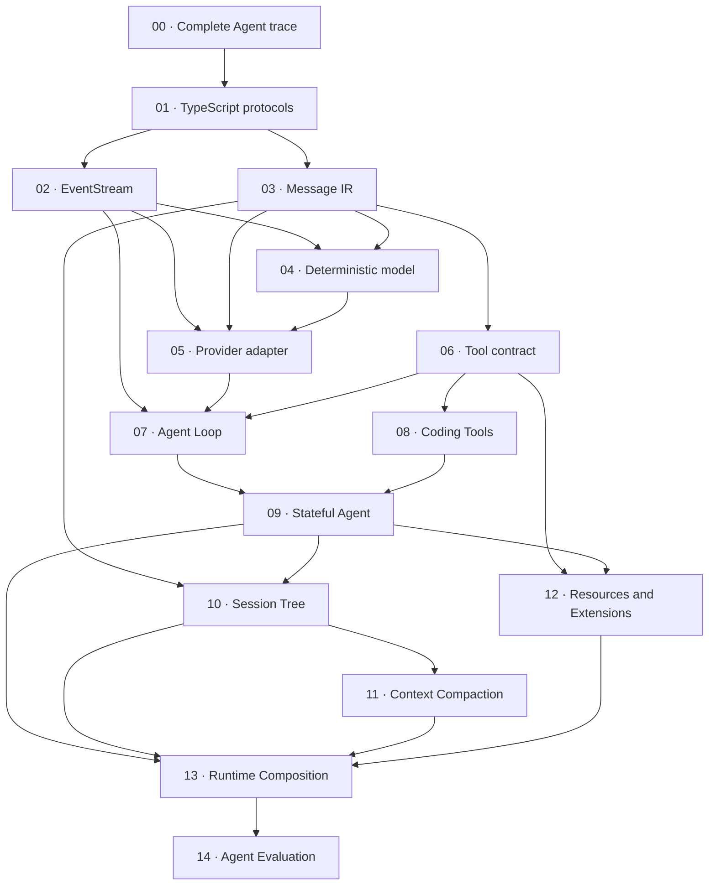

Khóa học này dành cho lập trình viên TypeScript muốn hiểu Agent bằng cách tự xây dựng từng boundary, thay vì bọc một model call trong framework lớn. Bạn sẽ theo một implementation tích lũy, bắt đầu từ dấu vết hoàn chỉnh rồi đi qua typed protocol, streaming, Tool, session bền vững, Context Compaction, Extension loading, Runtime Composition và deterministic evaluation.

:::caution[Phục vụ học tập và không chính thức]

Code trong `course/src/` là **Course implementation**. Đây là hệ thống giảng dạy đơn giản hóa, do Pify tự xây dựng và duy trì. Nó không phải package Pi chính thức, không import phần nội bộ chưa phát hành của Pi và không cam kết tương thích API với Pi. Chỉ nội dung mang nhãn **Pi SDK 0.84.3** mới mô tả bản SDK được phát hành riêng hoặc gọi tên public export đã được kiểm chứng của bản đó.

:::

## Bạn sẽ xây dựng gì

Workshop hoàn chỉnh là một Agent stack nhỏ nhưng chạy trọn vẹn. User message đi vào Agent Loop lặp. Model deterministic phát text hoặc yêu cầu một Tool. Loop validate rồi thực thi Tool, liên kết kết quả với Tool call ban đầu và tiếp tục cho đến khi nhận được terminal result có type rõ ràng. Các checkpoint sau bổ sung stateful prompt, Session Tree append-only, chọn context có giới hạn, Resource và Extension, runtime có thể thay thế cùng evaluation harness.

Khóa học phù hợp khi bạn xây Agent infrastructure, tích hợp Pi SDK, review một Agent framework hoặc cần test làm lộ lỗi protocol và lifecycle. Nội dung giả định bạn muốn xem tận cơ chế như quyền sở hữu iterator, cancellation, transcript validation, atomic registration, cleanup và bounded output. Khóa học không dạy prompt writing, thiết lập tài khoản provider hay triển khai production sandbox.

Mỗi checkpoint giữ nguyên contract của các checkpoint trước. Vì vậy, workshop có hai góc nhìn song song:

- các trang đánh số cô lập một cơ chế mới và một thử nghiệm lỗi có kiểm soát;
- toàn bộ thư mục `course/` cho thấy các cơ chế đó ghép thành một runtime như thế nào.

## Điều kiện tiên quyết

Hãy dùng Node.js 22 và dependency ở repository root. Bạn cần đọc được discriminated union, `Readonly` type, generic interface và hàm `async` trong TypeScript. Các checkpoint về streaming giả định bạn đã biết cơ bản về `Promise`, `AsyncIterable`, `for await...of` và `AbortSignal`. Quy trình test sử dụng Vitest, temporary filesystem fixture, assertion và test double.

Bạn không cần tài khoản provider, API key, model trả phí, database hoặc container runtime. Model và provider record trong workshop đều là deterministic fixture cục bộ. Sau khi dependency ở root đã được cài, mọi checkpoint test và toàn bộ workshop suite đều chạy mà không tạo provider network request. Trên máy mới, `npm ci` vẫn có thể cần kết nối npm registry để tải các dependency đó.

Repository đã chứa reference implementation hoàn chỉnh. Để thực hiện failure experiment mà không làm xáo trộn bản này, hãy làm trên một branch hoặc copy `course/` sang thư mục thực hành tạm thời. Bản phát hành hiện tại không có checkpoint generator và cũng không có solution branch ẩn riêng.

## Thiết lập và kiểm tra workshop

Chạy các lệnh từ repository root. Cài đặt một lần, sau đó chọn một checkpoint test cụ thể hoặc full cumulative suite:

```bash
npm ci
npm run test:course:checkpoint -- course/test/00-complete-agent-trace.test.ts
npm run test:course
```

`test:course:checkpoint` chuyển file selector cho Vitest và bắt buộc nhận đúng một đường dẫn `course/test/*.test.ts`. Lệnh trên chỉ chọn checkpoint `00`, không chạy mười bốn file còn lại. `test:course` chạy đủ mười lăm checkpoint file và chứng minh layer thêm sau không phá contract đã có trước.

Root lockfile là lockfile duy nhất của workshop. Không tạo `course/package.json` hoặc `course/package-lock.json`. Giữ workshop bên trong repository tài liệu giúp prose, source, focused test, cấu hình TypeScript và version dependency được review trong cùng một thay đổi.

## Kiến trúc tích lũy

Các mũi tên dưới đây biểu diễn dependency chính khi xây dựng. Đây không phải import graph: một số module về sau dùng lại nhiều contract trước đó. Hãy học checkpoint theo thứ tự số ngay cả khi sơ đồ tách nhánh.



Bảy implementation checkpoint đầu thiết lập data plane và execution plane: protocol xác định các value hợp lệ, `EventStream` vận chuyển progress theo đúng thứ tự, Message IR chuẩn hóa transcript, deterministic model input thay thế provider bên ngoài, adapter validate transport data không đáng tin cậy, Tool bao kín effect và Agent Loop điều phối round-trip.

Checkpoint `08` đến `13` bổ sung các yêu cầu khi host. Coding Tool giới hạn filesystem và process effect trong workspace đã khai báo. Stateful Agent tuần tự hóa prompt và sở hữu subscription. Session Tree lưu lịch sử liên kết bằng parent mà không làm phẳng branch. Context Compaction giữ nguyên một Tool round hoàn chỉnh. Resource và Extension đóng góp capability theo cách atomic. Runtime Composition trao các resource đó cho một owner với thứ tự replace và dispose xác định. Sau cùng, checkpoint `14` đánh giá hành vi đã ghép bằng evidence có giới hạn và đã rút gọn dữ liệu nhạy cảm, thay vì giữ raw transcript.

## Bản đồ checkpoint

Cột điều kiện tiên quyết ghi checkpoint đứng ngay trước trong lộ trình tích lũy. Cột source và focused test là đường dẫn literal trong repository; hãy dùng chúng thay vì tìm một production API có tên gần giống.

| Checkpoint | Kết quả | Course source | Focused test | Điều kiện tiên quyết |
| --- | --- | --- | --- | --- |
| [00 · Complete Agent trace](00-complete-agent-trace.md) | Dựng lại một dấu vết bất biến user → model → Tool → model → final response; kiểm tra thứ tự event và liên kết call/result ổn định. | `course/src/demo/prologue.ts` | `course/test/00-complete-agent-trace.test.ts` | Thiết lập repository |
| [01 · TypeScript protocols](01-typescript-protocols.md) | Biểu diễn message, chunk, Tool, event và terminal result bằng readonly discriminated union với xử lý exhaustive. | `course/src/protocol.ts` | `course/test/01-typescript-protocols.test.ts` | Checkpoint 00 |
| [02 · EventStream](02-event-stream.md) | Xây `AsyncIterable` event channel có một terminal result, buffered/waiting consumer, backpressure boundary và cleanup. | `course/src/event-stream.ts` | `course/test/02-event-stream.test.ts` | Checkpoint 01 |
| [03 · Message IR](03-message-ir.md) | Chuẩn hóa user, assistant và Tool-result message; từ chối Tool linkage sai; giữ nguyên JSON round-trip hợp lệ. | `course/src/messages.ts` | `course/test/03-message-ir.test.ts` | Checkpoint 02 |
| [04 · Deterministic model](04-deterministic-model.md) | Lập script cho response factory, ghi lại request, giữ chunk order, đồng thời làm rõ queue exhaustion và cancellation trong test. | `course/src/scripted-model.ts` | `course/test/04-deterministic-model.test.ts` | Checkpoint 03 |
| [05 · Provider adapter](05-provider-adapter.md) | Validate fixture record có type `unknown`, chuẩn hóa provider data và yêu cầu đúng một terminal event mà không dùng network. | `course/src/provider-adapter.ts` | `course/test/05-provider-adapter.test.ts` | Checkpoint 04 |
| [06 · Tool contract](06-tool-contract.md) | Validate trước effect, đăng ký Tool theo cách atomic, giới hạn serialized output, truyền cancellation và biểu diễn recoverable error. | `course/src/tool.ts` | `course/test/06-tool-contract.test.ts` | Checkpoint 05 |
| [07 · Agent Loop](07-agent-loop.md) | Điều phối model turn và nhiều Tool call với transcript ownership, ordered event, step budget, cancellation và stop reason có type. | `course/src/agent-loop.ts` | `course/test/07-agent-loop.test.ts` | Checkpoint 06 |
| [08 · Coding Tools](08-coding-tools.md) | Giới hạn file và Node process Tool bằng canonical path, atomic write, bounded output, timeout và execution không phụ thuộc platform. | `course/src/coding-tools.ts` | `course/test/08-coding-tools.test.ts` | Checkpoint 07 |
| [09 · Stateful Agent](09-stateful-agent.md) | Quản lý run state thay đổi qua immutable snapshot, busy guard, hàng đợi steering/follow-up an toàn, subscription và recovery. | `course/src/agent.ts` | `course/test/09-stateful-agent.test.ts` | Checkpoint 08 |
| [10 · Session Tree](10-session-tree.md) | Lưu JSONL entry liên kết bằng parent, chọn active leaf, chiếu branch, phục hồi truncated tail và từ chối middle corruption. | `course/src/session.ts` | `course/test/10-session-tree.test.ts` | Checkpoint 09 |
| [11 · Context Compaction](11-context-compaction.md) | Tính budget active context theo cách deterministic, giữ trọn Tool round, validate summary, giữ recent message và không mutate khi lỗi. | `course/src/context.ts` | `course/test/11-context-compaction.test.ts` | Checkpoint 10 |
| [12 · Resources and Extensions](12-resources-extensions.md) | Discover metadata dưới trusted root, activate lazy, commit contribution theo cách atomic, rollback lỗi và dispose theo thứ tự ngược. | `course/src/resources.ts` | `course/test/12-resources-extensions.test.ts` | Checkpoint 11 |
| [13 · Runtime Composition](13-runtime-composition.md) | Ghép workspace, Tool, Resource, Extension, session và Agent dưới một owner có thể replace với teardown deterministic. | `course/src/runtime.ts` | `course/test/13-runtime-composition.test.ts` | Checkpoint 12 |
| [14 · Agent Evaluation](14-agent-evaluation.md) | Chạy offline task có giới hạn, tách task verdict khỏi infrastructure error, so sánh candidate và serialize report an toàn cho dữ liệu. | `course/src/eval.ts` | `course/test/14-agent-evaluation.test.ts` | Checkpoint 13 |

Các đường dẫn trong bảng là một phần của course contract. Mỗi trang checkpoint lặp lại đúng module, test file, focused command, failure experiment và acceptance criteria của nó. Nếu prose và code không khớp, focused test đã commit xác định điều workshop hiện chứng minh; trang tài liệu phải được sửa trong cùng thay đổi.

## Cách học từng checkpoint

Hãy dùng một vòng lặp red/green ngắn thay vì đọc hết prose trước:

1. Đọc kết quả, điều kiện tiên quyết và cơ chế cho đến khi bạn có thể dự đoán event hoặc state transition mà test sẽ quan sát.
2. Chạy focused test một lần trên reference implementation chưa sửa và xác nhận chỉ file được nêu là pass.
3. Áp dụng thay đổi có kiểm soát trong failure experiment trên branch hoặc bản copy thực hành. Chạy lại cùng lệnh và đọc assertion bị fail; kết quả red đó phải chỉ ra contract, không phải một syntax error tùy ý.
4. Khôi phục dòng đã sửa, sau đó đọc hoặc tự implement module tương ứng trong `course/src/`. Giữ đúng tên protocol và limit mà focused test sử dụng.
5. Chạy lại focused test để nhận green, rồi chạy `npm run test:course` nhằm bắt regression ở layer trước.
6. Đọc phần so sánh với Pi sau cùng. Ánh xạ cơ chế sang SDK đã ghim release mà không thay identifier của workshop bằng identifier của Pi.

Ví dụ, vòng lặp cho checkpoint `04` dùng đúng các lệnh sau:

```bash
npm run test:course:checkpoint -- course/test/04-deterministic-model.test.ts
npm run test:course
```

Kết quả red do queue exhaustion chỉ có ý nghĩa khi experiment yêu cầu thêm một response vượt quá finite script. TypeScript compile error, file selector sai, lỗi cài dependency hoặc checkpoint khác bị fail không chứng minh hành vi đó. Hãy giữ experiment đủ hẹp để failure message trỏ ngược về đúng cơ chế được mô tả trên trang.

## Course implementation và Pi SDK 0.84.3

Callout **Course implementation** mô tả type và function được export từ `course/src/` trong repository này. Các tên như `EventStream`, `ScriptedModel`, `ToolRegistry`, `SessionTree` và `CourseRuntimeManager` tồn tại để workshop tách riêng từng concern. Signature, limit, error class, persistence format và lifecycle rule của chúng thuộc về workshop.

Callout **Pi SDK 0.84.3** so sánh concern đó với các package Pi đã phát hành ở version `0.84.3`. Nội dung so sánh có thể gọi tên một public export đã kiểm chứng, hoặc giải thích rằng Pi có contract phong phú hơn về provider, Tool, event, session hay runtime. Đây là hướng dẫn đọc, không phải chỉ dẫn đưa Course object vào một function của Pi. Đừng suy ra khả năng tương thích API chỉ vì có các thuật ngữ giống nhau như Agent, Tool, message, session hoặc compaction.

Sự phân tách này cũng xác định nguồn có thẩm quyền khi hai bên khác nhau. Focused course test là chuẩn cho Course implementation. Package `0.84.3` đã phát hành và source tương ứng với release đó là chuẩn cho phần so sánh Pi SDK. Hành vi trên upstream chưa phát hành nằm ngoài khóa học, trừ khi một trang ghi rõ đó là nội dung chưa phát hành.

## Tiêu chí hoàn thành

Bạn hoàn thành khóa học khi chứng minh được các contract, không phải chỉ khi đã đọc mười lăm trang:

- Node.js báo version `22.x` và repository dùng root lockfile;
- từng focused command chính xác chỉ chọn một checkpoint file và pass mà không cần API key hoặc provider request;
- `npm run test:course` pass đủ mười lăm checkpoint file sau mỗi thay đổi tích lũy;
- bạn lần theo được Tool call ID từ assistant request qua Tool result đến continuation, đồng thời xác định terminal run status;
- bạn giải thích được thành phần nào sở hữu iteration, cancellation, transcript mutation, session persistence, runtime replacement và cleanup ở từng boundary;
- failure experiment fail đúng invariant dự kiến và trở lại green sau khi khôi phục;
- bạn phân biệt được task failure với infrastructure failure và xác định evidence nào an toàn để lưu;
- bạn chỉ đúng **Course implementation** khi nói về workshop và **Pi SDK 0.84.3** khi nói về production SDK mà không trộn API của hai bên.

Bắt đầu với [checkpoint 00](00-complete-agent-trace.md). Trang đó cho bạn một dấu vết hoàn chỉnh trước khi checkpoint `01` tách dấu vết thành các protocol.
