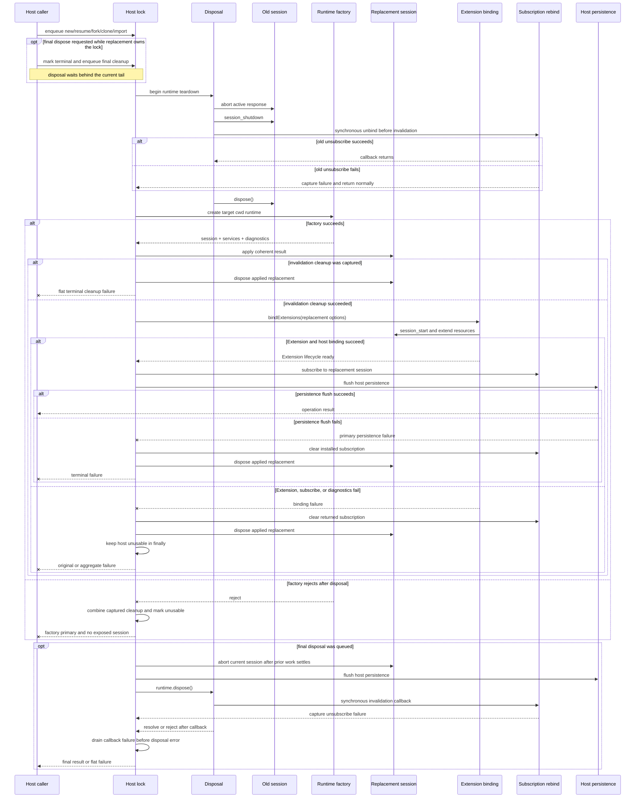

Một server chạy lâu, desktop shell hoặc RPC process không thể coi `AgentSession` là cố định khi người dùng có thể tạo session mới, resume project khác, fork lịch sử, clone một branch hoặc import JSONL. Pi `0.99.2` cung cấp `AgentSessionRuntime` làm boundary thay thế: nó sở hữu session hiện tại cùng các service gắn với cwd, còn host chịu trách nhiệm tuần tự hóa, subscription, diagnostic và failure policy.

Hướng dẫn này xây boundary đó chỉ bằng các public export ban đầu được ghi nhận cho `@earendil-works/pi-coding-agent@0.99.2`. Toàn bộ TypeScript shape được đồng bộ với `tests/fixtures/pi-sdk-0992.contract.ts` và compile-check bằng các declaration `@earendil-works/pi-coding-agent@0.99.2` đã cài đặt. Code nhận dependency thay vì tạo resource thật trong lúc kiểm tra.

Trước khi import public root đó trên Node.js `>=22.19.0`, hãy cài SDK bằng `npm install @earendil-works/pi-coding-agent@0.99.2`. Hướng dẫn này được audit theo Pi `v0.99.2`, commit `005af57d88ee23b33778f343a9595b32e67ff788`.

Với RPC prompt, input được handle tại Extension boundary trước mọi quyết định streaming queue và trả disposition `handled` mà không start hay queue một run. Prompt chưa được handle nhận trong lúc streaming phải đặt `streamingBehavior` thành `steer` hoặc `followUp`; preflight disposition chuẩn khi đó phân biệt `started` với `queued`. Vì vậy Extension command và input handler vẫn giữ interception boundary, còn response chỉ xác nhận prompt đã được chấp nhận chứ không xác nhận Agent run đã hoàn tất.

Tách biệt với các option của `prompt`, hai direct RPC wire command có tên chính xác là `steer` và `follow_up`; `followUp` không phải direct wire command. Mỗi command trả về `QueuedInputDisposition`: `handled` khi Extension input handler consume input, hoặc `queued` khi Pi đưa input vào queue. Nếu input handler transform thay vì consume input, Pi queue input đã transform và vẫn báo `queued`. Acknowledgement này mô tả kết quả preflight của command; nó không bảo đảm message vẫn còn trong queue sau đó.

Khi replacement, `abort()` dừng active run; runtime chờ đến khi run đó kết thúc hẳn rồi mới tiếp tục replacement teardown, nhờ đó aborted turn cùng Tool result đã hoàn tất vẫn được ghi trong session sắp rời đi. Boundary này là non-transactional: replacement failure sau teardown không rollback về old session đã dispose. Host không được phép công khai runtime bị thay dở vì thế cần fail-closed wrapper được mô tả bên dưới.

## Kết quả

Sau hướng dẫn này, bạn có thể:

- chọn giữa factory một session và runtime có thể thay thế;
- tách intent dùng chung cho process khỏi service phải dựng lại cho cwd đích;
- tuần tự hóa mọi thao tác thay thế qua một host lock;
- gỡ listener trước khi session cũ mất hiệu lực, bind Extension lifecycle của replacement, rồi mới cài host listener;
- ngừng công khai runtime nếu bước tạo thất bại sau teardown;
- xác minh cwd, diagnostic, persistence và disposal tại host boundary.

## 1. Chọn `createAgentSession()` hay `createAgentSessionRuntime()`

Dùng lifecycle owner nhỏ nhất phù hợp với ứng dụng.

| Nhu cầu | `createAgentSession()` | `createAgentSessionRuntime()` |
| --- | --- | --- |
| Một cwd cố định và một vòng đời session | Nên dùng | Tạo thêm abstraction không cần thiết |
| Host restart để mở session khác | Đủ dùng | Tùy chọn |
| New, resume, fork, clone hoặc import ngay trong process | Host phải tự dựng lại và swap mọi thành phần | Boundary thay thế phù hợp |
| Dựng lại settings, resource, Extension, model scope và Tool khi cwd đổi | Làm thủ công | Factory được gọi với cwd hiệu lực |
| Rebind listener của UI, RPC, telemetry hoặc persistence | Làm thủ công | Dùng `setBeforeSessionInvalidate()` và `setRebindSession()` |

`createAgentSession()` trả về session cùng dữ liệu Extension và model fallback. Caller vẫn sở hữu session đó và phải dispose nó. `createAgentSessionRuntime()` gọi typed factory lần đầu, rồi trả về `AgentSessionRuntime` tái sử dụng chính factory đó cho các lần thay thế sau.

Runtime là lifecycle coordinator, không phải concurrency lock hay transactional database. Hãy thêm host wrapper khi command có thể đến đồng thời hoặc khi replacement thất bại phải đưa process về trạng thái fail-closed.

## 2. Tách input dùng chung cho process khỏi input gắn với cwd

Resolve intent dùng chung cho process đúng một lần tại composition root. Giữ các resource path tường minh ở dạng absolute để lần đổi cwd sau không diễn giải lại chúng.

| Vòng đời | Ví dụ | Quy tắc |
| --- | --- | --- |
| Dùng chung cho process | `agentDir`, shutdown `AbortSignal`, CLI Tool allowlist, extra resource path tuyệt đối, telemetry sink, host persistence adapter, project-trust policy | Capture hoặc inject vào runtime factory |
| Gắn với cwd | `SettingsManager`, `ResourceLoader`, Extension và provider registration của project, model/Tool resolution hiệu lực, `SessionManager`, `AgentSession` | Dựng hoặc resolve lại trong factory cho mỗi cwd hiệu lực |

`createAgentSessionServices()` tạo một bộ service gắn với cwd nhất quán. Sau đó `createAgentSessionFromServices()` tạo session dựa trên các service đó và `SessionManager` đã chọn. API hai giai đoạn này ngăn settings hoặc Extension ở thư mục startup rò sang session được resume từ project khác.

Project trust cũng phải được đánh giá theo cwd đích. Ví dụ inject `authorizeProject(...)`; host production có thể dùng `projectTrustContext` của factory để hỏi qua UI hoặc policy layer của chính nó trước khi load resource do project kiểm soát.

## 3. Cài đặt `CreateAgentSessionRuntimeFactory` có type đầy đủ

Code dưới đây là compile-only host shape hoàn chỉnh. `CreateAgentSessionRuntimeFactory` buộc factory trả về session mới, các service tương ứng và diagnostic như một kết quả nhất quán. `bindSerializedSessionRuntimeHost()` sở hữu lifecycle policy qua port hẹp `Pick<AgentSessionRuntime, ...>`; `AgentSessionRuntime` thật thỏa type này, còn test có thể inject fake in-memory. Compile fixture không gọi hai function export, nên bước compile không đọc credential, scan project hay mở session file.

```typescript title="replaceable-session-runtime.ts"
import {
  type AgentSession,
  type AgentSessionRuntime,
  type AgentSessionRuntimeDiagnostic,
  type CreateAgentSessionRuntimeFactory,
  type CreateAgentSessionServicesOptions,
  createAgentSessionFromServices,
  createAgentSessionRuntime,
  createAgentSessionServices,
} from "@earendil-works/pi-coding-agent";

export function throwSessionBindingFailure(
  primary: unknown,
  cleanupFailures: readonly unknown[],
  phase: string,
): never {
  if (cleanupFailures.length === 0) throw primary;
  throw new AggregateError(
    [primary, ...cleanupFailures],
    `${phase} failed and cleanup also failed`,
    { cause: primary },
  );
}

export async function bindSerializedSessionRuntimeHost(
  runtime: Pick<
    AgentSessionRuntime,
    | "session"
    | "cwd"
    | "diagnostics"
    | "setBeforeSessionInvalidate"
    | "setRebindSession"
    | "newSession"
    | "switchSession"
    | "fork"
    | "importFromJsonl"
    | "dispose"
  >,
  bindings: {
    extensionBindings(
      session: AgentSession,
    ): Parameters<AgentSession["bindExtensions"]>[0];
    subscribe(session: AgentSession): () => void;
    reportDiagnostics(
      diagnostics: readonly AgentSessionRuntimeDiagnostic[],
    ): void;
    flushPersistence(): Promise<void>;
  },
): Promise<{
  readonly cwd: string;
  readonly diagnostics: readonly AgentSessionRuntimeDiagnostic[];
  newSession(): ReturnType<AgentSessionRuntime["newSession"]>;
  resume(
    sessionPath: string,
    cwdOverride?: string,
  ): ReturnType<AgentSessionRuntime["switchSession"]>;
  fork(entryId: string): ReturnType<AgentSessionRuntime["fork"]>;
  clone(entryId: string): ReturnType<AgentSessionRuntime["fork"]>;
  importJsonl(
    inputPath: string,
    cwdOverride?: string,
  ): ReturnType<AgentSessionRuntime["importFromJsonl"]>;
  dispose(): Promise<void>;
}> {
  let tail: Promise<void> = Promise.resolve();
  let unsubscribe: (() => void) | undefined;
  let invalidationCleanupFailures: unknown[] = [];
  let replacementInFlight = false;
  let unusable = false;
  let disposed = false;

  class CapturedSessionBindingFailure {
    constructor(
      readonly primary: unknown,
      readonly cleanupFailures: unknown[],
    ) {}
  }

  const clearSubscription = () => {
    const release = unsubscribe;
    unsubscribe = undefined;
    release?.();
  };
  const clearSubscriptionAfterFailure = (cleanupFailures: unknown[]) => {
    try {
      clearSubscription();
    } catch (error) {
      cleanupFailures.push(error);
    }
  };
  const takeInvalidationCleanupFailures = () => {
    const failures = invalidationCleanupFailures;
    invalidationCleanupFailures = [];
    return failures;
  };
  const bindSession = async (session: AgentSession) => {
    try {
      clearSubscription();
      await session.bindExtensions(bindings.extensionBindings(session));
      unsubscribe = bindings.subscribe(session);
      bindings.reportDiagnostics(runtime.diagnostics);
    } catch (error) {
      const cleanupFailures: unknown[] = [];
      clearSubscriptionAfterFailure(cleanupFailures);
      throw new CapturedSessionBindingFailure(error, cleanupFailures);
    }
  };
  const disposeRuntimeFailure = async (
    error: unknown,
    phase: string,
  ): Promise<never> => {
    const captured =
      error instanceof CapturedSessionBindingFailure
        ? error
        : new CapturedSessionBindingFailure(error, []);
    replacementInFlight = true;
    unusable = true;
    const cleanupFailures = [...captured.cleanupFailures];
    try {
      clearSubscriptionAfterFailure(cleanupFailures);
      try {
        await runtime.dispose();
      } catch (disposeError) {
        cleanupFailures.push(disposeError);
      }
    } finally {
      replacementInFlight = true;
      unusable = true;
      clearSubscriptionAfterFailure(cleanupFailures);
    }
    return throwSessionBindingFailure(captured.primary, cleanupFailures, phase);
  };
  const assertAvailable = () => {
    if (disposed) throw new Error("session runtime host is disposed");
    if (unusable || replacementInFlight) {
      throw new Error("session runtime host has no usable current session");
    }
  };
  const enqueue = <T>(operation: () => Promise<T>): Promise<T> => {
    const pending = tail.then(operation);
    tail = pending.then(
      () => undefined,
      () => undefined,
    );
    return pending;
  };
  const serialize = <T>(operation: () => Promise<T>): Promise<T> =>
    enqueue(async () => {
      assertAvailable();
      try {
        return await operation();
      } catch (error) {
        if (replacementInFlight) {
          unusable = true;
          return throwSessionBindingFailure(
            error,
            takeInvalidationCleanupFailures(),
            "session replacement",
          );
        }
        throw error;
      }
    });
  const replace = <T>(operation: () => Promise<T>): Promise<T> =>
    serialize(async () => {
      const result = await operation();
      try {
        await bindings.flushPersistence();
      } catch (error) {
        return disposeRuntimeFailure(error, "replacement persistence");
      }
      return result;
    });

  runtime.setBeforeSessionInvalidate(() => {
    replacementInFlight = true;
    clearSubscriptionAfterFailure(invalidationCleanupFailures);
  });
  runtime.setRebindSession(async (session) => {
    const cleanupFailures = takeInvalidationCleanupFailures();
    if (cleanupFailures.length > 0) {
      const [primary, ...remaining] = cleanupFailures;
      return disposeRuntimeFailure(
        new CapturedSessionBindingFailure(primary, remaining),
        "replacement invalidation cleanup",
      );
    }
    try {
      await bindSession(session);
      replacementInFlight = false;
    } catch (error) {
      return disposeRuntimeFailure(error, "replacement session binding");
    }
  });

  try {
    await bindSession(runtime.session);
  } catch (error) {
    return disposeRuntimeFailure(error, "initial session binding");
  }

  const dispose = (): Promise<void> => {
    if (disposed) {
      return Promise.reject(new Error("session runtime host is disposed"));
    }
    disposed = true;
    unusable = true;
    return enqueue(async () => {
      const failures: unknown[] = [];
      try {
        await runtime.session.abort();
      } catch (error) {
        failures.push(error);
      }
      try {
        await bindings.flushPersistence();
      } catch (error) {
        failures.push(error);
      }
      let runtimeDisposeFailure: unknown;
      let runtimeDisposeFailed = false;
      try {
        await runtime.dispose();
      } catch (error) {
        runtimeDisposeFailed = true;
        runtimeDisposeFailure = error;
      }
      failures.push(...takeInvalidationCleanupFailures());
      if (runtimeDisposeFailed) failures.push(runtimeDisposeFailure);
      clearSubscriptionAfterFailure(failures);
      if (failures.length > 0) {
        const [primary, ...cleanupFailures] = failures;
        return throwSessionBindingFailure(
          primary,
          cleanupFailures,
          "final session runtime disposal",
        );
      }
    });
  };

  return {
    get cwd() {
      assertAvailable();
      return runtime.cwd;
    },
    get diagnostics() {
      assertAvailable();
      return runtime.diagnostics;
    },
    newSession: () => replace(() => runtime.newSession()),
    resume: (sessionPath, cwdOverride) =>
      replace(() => runtime.switchSession(sessionPath, { cwdOverride })),
    fork: (entryId) => replace(() => runtime.fork(entryId)),
    clone: (entryId) =>
      replace(() => runtime.fork(entryId, { position: "at" })),
    importJsonl: (inputPath, cwdOverride) =>
      replace(() => runtime.importFromJsonl(inputPath, cwdOverride)),
    dispose,
  };
}

export async function createSerializedSessionRuntimeHost(
  processInputs: Pick<
    CreateAgentSessionServicesOptions,
    | "modelRuntimeSignal"
    | "extensionFlagValues"
    | "resourceLoaderOptions"
    | "resourceLoaderReloadOptions"
  > & {
    tools?: string[];
    authorizeProject?: (options: {
      cwd: string;
      projectTrustContext: Parameters<CreateAgentSessionRuntimeFactory>[0]["projectTrustContext"];
    }) => Promise<void>;
  },
  initial: Parameters<typeof createAgentSessionRuntime>[1],
  bindings: {
    extensionBindings(
      session: AgentSession,
    ): Parameters<AgentSession["bindExtensions"]>[0];
    subscribe(session: AgentSession): () => void;
    reportDiagnostics(
      diagnostics: readonly AgentSessionRuntimeDiagnostic[],
    ): void;
    flushPersistence(): Promise<void>;
  },
): Promise<{
  readonly cwd: string;
  readonly diagnostics: readonly AgentSessionRuntimeDiagnostic[];
  newSession(): ReturnType<AgentSessionRuntime["newSession"]>;
  resume(
    sessionPath: string,
    cwdOverride?: string,
  ): ReturnType<AgentSessionRuntime["switchSession"]>;
  fork(entryId: string): ReturnType<AgentSessionRuntime["fork"]>;
  clone(entryId: string): ReturnType<AgentSessionRuntime["fork"]>;
  importJsonl(
    inputPath: string,
    cwdOverride?: string,
  ): ReturnType<AgentSessionRuntime["importFromJsonl"]>;
  dispose(): Promise<void>;
}> {
  const { tools, authorizeProject, ...serviceInputs } = processInputs;
  const createRuntime: CreateAgentSessionRuntimeFactory = async ({
    cwd,
    agentDir,
    sessionManager,
    sessionStartEvent,
    projectTrustContext,
  }) => {
    await authorizeProject?.({ cwd, projectTrustContext });
    const services = await createAgentSessionServices({
      ...serviceInputs,
      cwd,
      agentDir,
    });
    const created = await createAgentSessionFromServices({
      services,
      sessionManager,
      sessionStartEvent,
      tools,
    });
    return {
      ...created,
      services,
      diagnostics: [...services.diagnostics],
    };
  };

  const runtime: AgentSessionRuntime = await createAgentSessionRuntime(
    createRuntime,
    initial,
  );
  return bindSerializedSessionRuntimeHost(runtime, bindings);
}
```

Factory chủ động trả về bản sao của `services.diagnostics`. Bạn có thể thêm diagnostic của host, model selection, custom Tool và kết quả trust trước khi return, nhưng phải giữ chúng gắn với đúng cặp `services` và `session` đó.

## 4. Tạo runtime ban đầu

Caller truyền `cwd`, `agentDir` và `SessionManager` ban đầu qua argument `initial`. Trong composition root thật, chỉ tạo manager sau khi quyết định startup là session mới, session in-memory, session gần nhất hay một file cụ thể. Cwd hiệu lực của manager phải tồn tại; `createAgentSessionRuntime()` validate boundary này trước khi gọi factory.

Từ góc nhìn caller, bước tạo đầu tiên là atomic: helper chỉ return sau khi factory tạo đủ `AgentSessionRuntime`, `bindExtensions(...)` hoàn tất initial Extension lifecycle và host subscription đầu tiên đã bind. Nếu authorization, load service, Extension binding hoặc tạo session reject, wrapper không được trả về.

Không resolve project settings hoặc relative Extension path trước khi biết cwd hiệu lực của session. Resume hoặc import có thể chọn session với cwd khác `process.cwd()`.

## 5. Bind host subscription vào `AgentSession` hiện tại

`bindings.extensionBindings(session)` trả về public options shape qua `Parameters<AgentSession["bindExtensions"]>[0]`; hướng dẫn không cần import non-top-level type `ExtensionBindings` của Pi. Hãy cung cấp mode, UI context, command action, abort/shutdown handler và error listener mà host cần. Các callback có thể capture serialized operation của wrapper nhưng không được bỏ qua lock của nó.

`await session.bindExtensions(...)` apply các binding đó, phát event `session_start` của chính session và cho Extension mở rộng resource đã load. Bước này phải hoàn tất cho initial session và mọi replacement trước khi host công khai event từ session đó. Sau đó `bindings.subscribe(session)` mới là ownership boundary cho UI rendering, RPC notification, telemetry hoặc transcript projection. Nó phải trả về một unsubscribe function idempotent để gỡ mọi host listener đã cài cho session.

Helper bất đồng bộ `bindSession()` dùng chung áp đặt đúng thứ tự cho cả hai path: clear host subscription cũ, await Extension binding, cài host subscription rồi report diagnostic. Nếu Extension binding, bước cài subscription hoặc report diagnostic throw, catch path sẽ gỡ mọi unsubscribe handle đã được trả về. Adapter `subscribe(...)` phải tự bảo đảm tính atomic: nếu nó throw trước khi trả cleanup function, chính adapter phải rollback mọi listener đã cài một phần. Không cache `runtime.session` trong service khác; hãy chuyển event phát sinh từ session qua binding adapter.

Nếu initial Extension hoặc host binding thất bại, ví dụ clear mọi subscription đã trả về, đánh dấu host unavailable, dispose runtime vừa tạo rồi reject startup. `CapturedSessionBindingFailure` mang lỗi binding gốc và mọi lỗi unsubscribe dưới dạng dữ liệu trong khi disposal chạy; nó không được công khai như lỗi cuối cùng. Lỗi binding gốc được rethrow khi mọi bước cleanup đều thành công. Đây là fail-closed: host thiếu lifecycle, observation hoặc persistence boundary hoàn chỉnh sẽ không bắt đầu phục vụ request.

## 6. Tuần tự hóa new, resume, fork, clone và import

`AgentSessionRuntime` không tuần tự hóa caller. Promise `tail` trong wrapper chính là host lock: mỗi thao tác chỉ bắt đầu sau khi thao tác trước fulfill hoặc reject. Nhánh reject reset queue nhưng không che lỗi của thao tác khỏi caller tương ứng.

| Ý định của host | Release API | Kết quả quan trọng |
| --- | --- | --- |
| New | `runtime.newSession()` | Có thể trả `{ cancelled: true }` từ `session_before_switch` |
| Resume | `runtime.switchSession(path, { cwdOverride })` | Dựng lại service theo cwd hiệu lực của saved session |
| Fork | `runtime.fork(entryId)` | Mặc định `position: "before"` và có thể trả `selectedText` |
| Clone | `runtime.fork(entryId, { position: "at" })` | Clone là ý định của host, không phải method riêng trên `AgentSessionRuntime` |
| Import | `runtime.importFromJsonl(path, cwdOverride)` | Copy/mở JSONL trong session directory rồi switch theo resume semantics |

Request handler chỉ được gọi method trên wrapper. Nếu bỏ qua wrapper và gọi runtime bên dưới đồng thời, teardown và creation có thể xen kẽ, listener có thể rebind vào sai session, hoặc một operation có thể hành động trên state vừa bị operation khác thay thế.

Before-event bị cancel sẽ return mà không vô hiệu session cũ. Đây là kết quả bình thường, không phải factory failure. Missing file, entry không hợp lệ hoặc missing cwd cũng có thể xảy ra trước teardown; wrapper propagate chúng nhưng giữ binding hiện tại.

## 7. Unbind session cũ và bind session thay thế

Release lifecycle cung cấp hai callback cho hai thời điểm khác nhau:

- `setBeforeSessionInvalidate()` chạy đồng bộ sau khi handler `session_shutdown` hoàn tất nhưng trước khi session cũ bị dispose. Wrapper đánh dấu replacement đang diễn ra và thử gỡ listener cũ tại đây. Vì Pi không await callback này, wrapper capture unsubscribe failure vào `invalidationCleanupFailures` và luôn return bình thường; disposal của session cũ và factory vẫn phải tiếp tục.
- `setRebindSession()` được await sau khi kết quả factory đã apply. Wrapper gọi cùng helper `bindSession()`, await `session.bindExtensions(...)` trước khi cài host subscription và report diagnostic. Chỉ sau đó nó mới đánh dấu host available trở lại.

Runtime cập nhật `session`, `services`, `diagnostics` và `modelFallbackMessage` cùng lúc trước callback rebind. Nếu synchronous invalidation cleanup đã bị capture, rebind không công khai replacement: nó dispose applied runtime rồi propagate cleanup error đó làm primary failure. Nếu `bindSession()` thất bại, wrapper clear mọi subscription đã trả về và đi qua cùng disposal path. Nếu factory reject trước apply, serialized operation kết hợp factory error làm primary với các invalidation cleanup error đã capture. Mọi path đều giữ trạng thái terminal. Wrapper công khai cwd và diagnostic nhưng chủ động không công khai raw `AgentSessionRuntime`; request code không thể đọc session cũ đã dispose hoặc applied replacement bị lỗi.

### Giữ `SessionManager` làm nguồn chuẩn sau khi thay session

Mỗi replacement session lấy provider context từ `SessionManager` của chính nó. Khi khôi phục entry do external store sở hữu, factory dựng `SessionManager.inMemory(cwd, { id: sessionId }, entries)`. Sau rebind, mọi thay đổi context phải đi qua public session operation thay vì gán transcript của Agent bên dưới.

| Thao tác của host | Public API | Kết quả context |
| --- | --- | --- |
| `khôi phục từ nguồn ngoài` | `SessionManager.inMemory(cwd, { id: sessionId }, entries)` | `provider context chuẩn` |
| `điều hướng tree` | `session.navigateTree(targetId)` | `làm mới projection chuẩn` |
| `append thủ công` | `thao tác append qua session.sessionManager → session.refreshContext()` | `làm mới projection chuẩn` |

`navigateTree()` di chuyển leaf đã chọn rồi dựng lại finalized context cùng Tool state. Nếu host chủ động append qua `session.sessionManager`, host phải gọi `session.refreshContext()` trước request kế tiếp. `ContextEditEntry` chỉ đổi future provider projection; raw transcript và UI history vẫn append-only. Binding dùng để render hoặc persist raw tree nên tiếp tục dựa trên session event cùng manager entry, không dùng projected message array hiện tại như audit record.



## 8. Dispose resource cũ và flush persistence

Khi replacement, teardown nội bộ của Pi trước hết await `oldSession.abort()`. Bước này settle response đang hoạt động để aborted turn và Tool result của nó có thể được ghi vào session sắp rời đi. Sau đó runtime await `session_shutdown`, chạy invalidation callback đồng bộ và gọi `oldSession.dispose()` trước khi gọi factory. Không được tái sử dụng Extension runner cũ hay resource do session sở hữu sau thời điểm đó.

`SessionManager` append record JSONL của Pi qua chính session operation; `AgentSessionRuntime` không có public method `flush()` bất đồng bộ. `flushPersistence()` trong ví dụ chỉ dành cho persistence, event projection hoặc durable queue do host sở hữu. Nó chạy sau mỗi rebind thành công. Nếu flush reject, installed replacement không còn an toàn để công khai: adapter chuyển sang terminal, clear subscription, thử `runtime.dispose()` rồi reject operation.

Pi `0.99.2` cũng sửa bốn edge case khi thay session. JSONL import trùng filename nhận suffix số thay vì ghi đè session file hiện có, còn share session đồng thời không ghi đè lẫn nhau. Fork giữ nguyên ranh giới compaction. Với fork in-memory được yêu cầu trước khi active turn settle, teardown của runtime await `abort()` trước khi mutate manager dùng chung, nên fork quan sát outgoing turn đã settle. Đây là các bảo đảm collision và ordering có phạm vi hẹp, không phải bảo đảm transaction tổng quát hoặc validate schema đầy đủ cho JSONL import.

Final shutdown cũng được tuần tự hóa, nhưng có thể được yêu cầu khi một healthy replacement đang giữ host lock. Lần gọi `host.dispose()` đầu tiên không chạy `assertAvailable()` và không reject chỉ vì `replacementInFlight` đang set. Nó atomically set `disposed` cùng `unusable`, rồi enqueue cleanup sau `tail` hiện tại. In-flight operation settle trước; operation đã queue hoặc đến sau sẽ chạm terminal guard mà không gọi thêm runtime method. Getter reject ngay lập tức. Lần gọi `dispose()` lặp lại reject bằng disposed-state error đã định nghĩa và không schedule cleanup trùng.

Final cleanup thử độc lập `runtime.session.abort()`, flush host persistence, `runtime.dispose()` và explicit unsubscribe fallback, nên failure ở một bước không được bỏ qua bước sau. Chính `runtime.dispose()` của Pi gọi `setBeforeSessionInvalidate()` đồng bộ. Vì vậy adapter drain `invalidationCleanupFailures` sau `runtime.dispose()` trên cả path resolve lẫn reject. Callback unsubscribe failure được ghi trước runtime-disposal rejection xảy ra sau nó, đúng thứ tự thực tế; không lỗi nào bị mất. Failure đầu tiên giữ vai trò primary, các failure sau được nối vào một `AggregateError` phẳng. Hãy await kết quả trước khi đóng resource dùng chung cho process như database pool hoặc telemetry exporter. Access vẫn terminal kể cả khi cleanup thất bại.

## 9. Xử lý factory failure mà không để lộ half-replaced session

Replacement trong Pi `0.99.2` không phải rollback transaction. `AgentSessionRuntime` dispose session cũ trước khi await factory mới. Nếu factory reject, runtime propagate error và không chạy bước apply hoặc rebind nội bộ; object cũ đã mất hiệu lực còn replacement dùng được chưa tồn tại.

Wrapper phát hiện đúng boundary này vì `setBeforeSessionInvalidate()` đã đặt `replacementInFlight`, còn `setRebindSession()` thành công chỉ xóa flag sau khi Extension binding và host binding hoàn tất. Callback đồng bộ không bao giờ throw: unsubscribe failure được giữ lại cho awaited boundary. Factory rejection xảy ra trước apply nên không có replacement cần dispose; wrapper propagate nó làm primary và nối cleanup failure đã giữ lại. Invalidation-cleanup rejection, `bindExtensions(...)`, host subscription, diagnostic reporting hoặc post-rebind persistence rejection sau apply đều dispose installed replacement trước khi propagate. `finally` giữ wrapper unusable kể cả khi disposal thất bại. Không có raw session nào được public, còn operation và state getter sau đó đều reject. Đây là policy no-half-replacement, fail-closed bắt buộc.

Cleanup failure không bao giờ thay thế hoặc lồng bằng chứng chính. `disposeRuntimeFailure()` bắt đầu bằng cleanup failure đã capture, nối thêm failure về sau theo thứ tự xảy ra, rồi chỉ gọi `throwSessionBindingFailure()` đúng một lần. Final disposal giữ riêng runtime-disposal rejection cho đến khi drain xong failure được capture trong synchronous invalidation callback của chính call đó; sau đó mới nối rejection xảy ra muộn hơn. Khi không có failure bổ sung, helper rethrow primary ban đầu. Nếu có, nó throw một `AggregateError` duy nhất với `.errors` là `[primary, ...cleanupFailures]` và `.cause` là `primary`. Hãy log cấu trúc aggregate phẳng đó nhưng không serialize session content, đồng thời xem từng phần tử là một operational incident.

Không catch lỗi rồi tiếp tục phục vụ qua một session đã cache. Hãy ghi operation, target path hoặc cwd và error nhưng không log transcript content hay secret. Sau đó kết thúc worker đang sở hữu runtime, hoặc dựng host mới từ một safe startup target tường minh. Chỉ retry tự động khi host vẫn unavailable và mỗi attempt dựng một runtime mới hoàn chỉnh.

Lỗi phát sinh trước invalidation là trường hợp khác. Ví dụ Extension có thể cancel switch hoặc fork, còn file/cwd validation có thể thất bại trước teardown. Khi đó session cũ vẫn là session hiện tại; wrapper propagate result hoặc error nhưng không tự poison.

## 10. Xác minh cwd, diagnostic và acceptance criteria

Test wrapper bằng một harness inject binding giả và runtime factory có kiểm soát. Production compile contract chứng minh compatibility với public type; behavioral test còn phải quan sát sequencing và failure state mà không dùng provider thật.

Xác minh các invariant sau:

- [ ] `host.cwd` bằng cwd hiệu lực của `runtime.services` hiện tại, không nhất thiết bằng `process.cwd()` lúc startup.
- [ ] Absolute resource path dùng chung cho process giữ nguyên ý nghĩa sau resume hoặc import.
- [ ] Mỗi replacement thành công tạo đúng một bộ session/services/diagnostics khớp nhau và report diagnostic mới đúng một lần.
- [ ] Call new, resume, fork, clone và import không bao giờ overlap, kể cả sau khi command trước reject.
- [ ] Clone gọi `fork(entryId, { position: "at" })`; fork giữ semantics mặc định `"before"`.
- [ ] Old unsubscribe failure được capture đồng bộ mà không thoát khỏi invalidation callback; old disposal và factory tiếp tục, rồi applied replacement được dispose hoặc factory error được kết hợp với cleanup failure.
- [ ] Mỗi replacement await `bindExtensions(...)` trước khi cài host subscription và trước khi host available.
- [ ] Cancellation hoặc pre-validation failure vẫn giữ binding cũ dùng được.
- [ ] Factory rejection sau invalidation không công khai session nào; binding failure sau apply cũng clear subscription và dispose applied replacement. Cả hai vĩnh viễn reject operation sau đó trên wrapper này.
- [ ] Post-rebind persistence failure đưa adapter về terminal, clear installed subscription, dispose replacement và reject mọi access về sau.
- [ ] Nếu unsubscribe hoặc replacement disposal thất bại, `AggregateError` duy nhất được propagate có `.errors` phẳng theo thứ tự primary rồi các cleanup failure theo lúc xảy ra, còn `.cause` là primary failure.
- [ ] Có thể yêu cầu final disposal trong lúc healthy replacement đang chạy: host chuyển terminal ngay, chờ sau current tail, cleanup session hiện tại sau replacement và reject disposal request trùng.
- [ ] Final cleanup thử abort, persistence flush, runtime disposal và unsubscribe; failure từ invalidation callback được drain dù runtime disposal resolve hay reject và được xếp trước disposal error xảy ra sau.
- [ ] Diagnostic output redact secret và định danh operation cùng target cwd hoặc session path.

Với acceptance run thật, tạo session trong hai thư mục cwd tạm, switch qua lại và assert project-local settings cùng resource đến từ cwd đã chọn. Dùng in-memory hoặc faux provider để lifecycle evidence không phụ thuộc network hay credential.

## Bản đồ nguồn cho Pi 0.99.2

Mọi claim ở trên đều được khóa tại release commit `005af57d88ee23b33778f343a9595b32e67ff788`:

| Nguồn | Contract được xác minh |
| --- | --- |
| [`agent-session.ts`](https://github.com/earendil-works/pi/blob/005af57d88ee23b33778f343a9595b32e67ff788/packages/coding-agent/src/core/agent-session.ts) | Parameter public của `AgentSession.bindExtensions(...)`, apply Extension binding, `session_start` và thứ tự mở rộng resource |
| [`agent-session-runtime.ts`](https://github.com/earendil-works/pi/blob/005af57d88ee23b33778f343a9595b32e67ff788/packages/coding-agent/src/core/agent-session-runtime.ts) | Factory/result type, getter, method new/resume/fork/import, callback order, teardown-before-create, apply, thay diagnostic và disposal |
| [`agent-session-services.ts`](https://github.com/earendil-works/pi/blob/005af57d88ee23b33778f343a9595b32e67ff788/packages/coding-agent/src/core/agent-session-services.ts) | Tạo service gắn với cwd, diagnostic và tạo session từ bộ service nhất quán |
| [`sdk.ts`](https://github.com/earendil-works/pi/blob/005af57d88ee23b33778f343a9595b32e67ff788/packages/coding-agent/src/core/sdk.ts) | Contract trực tiếp của `createAgentSession()` và các public re-export dùng trong hướng dẫn |

## Bước tiếp theo

- [Lưu session](persist-sessions.md) giải thích session JSONL tree và thao tác `SessionManager` trực tiếp.
- [Test Agent theo cách deterministic](test-agent-deterministically.md) cung cấp provider fixture không cần network cho lifecycle test.
- [Chương 11: Testing và Agent evaluation](../ch11-testing-evaluation.md) đặt runtime acceptance test trong chiến lược evidence rộng hơn.
