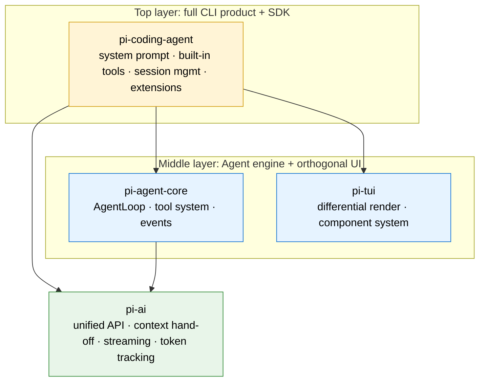

# Chapter 1: Introduction: Why Pi-Agent Is Worth Your Time

> This is the opening chapter of "Pi-Agent in Depth." It does not dig into source code; it answers a more fundamental question: what is Pi, and why is it worth your time? By the end you will have a clear mental model of Pi's three identities: **coding tool, learning material, development SDK**.

---

## 1. Opening: three questions, one answer

You probably opened this series for one of three reasons:

1. **"I want a coding agent that works"**: you are tired of bloated tools and want something minimal, transparent, fast.
2. **"I want to understand how an agent is built"**: you have poked at the source of other agent frameworks, and they were either too complex (tens of thousands of lines) or too naive (a single `while` loop calling itself an agent).
3. **"I want to build my own agent"**: you have a vertical use case and need to build on top of an SDK rather than start from scratch.

These three questions line up exactly with Pi's three identities. The fact that they all point to a single project is itself worth being curious about.

Before diving into the source, step back and look at the full picture.

---

## 2. What is Pi: a single diagram

### One-sentence definition

**Pi is a minimal, extensible terminal coding agent shell (a coding agent harness), created by Mario Zechner (the author of libGDX), written entirely in TypeScript, and released under the MIT license.**

Breaking it apart:

- **"Coding Agent"**: it reads your codebase, writes code, edits code, runs commands; like a pair-programming partner sitting next to you.
- **"Terminal Shell"**: it lives in the terminal, no GUI, no IDE plugin; output is written to the terminal scrollback buffer. This single decision drives every downstream design choice.
- **"Minimal"**: four core built-in tools (`read` / `write` / `edit` / `bash`), a static system prompt template of roughly 90 English words (about 200–400 words after tools, skills, and contextFiles are stitched in at runtime), and around 12,000 lines of TUI code (the core `tui.ts` file alone is about 1,700 lines). It deliberately does **not** build MCP, sub-agents, plan mode, permission dialogs, or background bash.
- **"Extensible"**: the missing features above the minimal core are filled in by TypeScript Extensions, Skills, and Pi Packages.

### Key numbers

| Metric | Value | Meaning |
| --- | --- | --- |
| GitHub Stars | 64,000+ | Ten months of growth; demand is community-validated. |
| Built-in tools | 4 core + 3 helpers | Core: `read` / `write` / `edit` / `bash`; helpers: `grep` / `find` / `ls`. |
| System prompt | Static template ~90 words (200–400 words at runtime) | Compare with Claude Code's tens of thousands of words. |
| TUI codebase | ~12,000 lines | The core `tui.ts` file alone is about 1,700 lines; Mario's game-engine background shows in the restraint. |
| Supported providers | 30+ | The source `KnownProvider` enum lists 35 (including regional variants); about 27 unique brands: Anthropic, OpenAI, Google, Groq, Ollama, etc. |
| Core packages | 4 | `pi-ai` / `pi-agent-core` / `pi-tui` / `pi-coding-agent`. |
| Run modes | 4 | Interactive / print-JSON / RPC / SDK. |

> **A note on the numbers**: Pi's early marketing materials often cited "4 built-in tools", "15+ providers", and "~600 lines of TUI". The first two refer to the **4 core tools** (excluding the `grep` / `find` / `ls` helpers) and a curated list of well-known providers from earlier versions. The "600 lines of TUI" was accurate for an early version; by v0.80.2 it had grown to roughly 12,000 lines. This table reflects **v0.80.2 source numbers** so readers cross-checking against source are not confused.

### Four core packages, each with a job

```
┌──────────────────────────────────────────┐
│          pi-coding-agent                 │  ← full CLI product + SDK
│  System prompt · Built-in tools · Session management · Extensions  │
├──────────────────────────────────────────┤
│  pi-tui              │  pi-agent-core    │  ← terminal UI + Agent engine
│  Differential render  │  AgentLoop · Tool │
│  · component system   │  system · events  │
├──────────────────────┴───────────────────┤
│              pi-ai                       │  ← multi-provider LLM abstraction
│  Unified API · Context hand-off · Streaming · Token tracking  │
└──────────────────────────────────────────┘
```



In these four layers, `pi-ai` / `pi-agent-core` / `pi-coding-agent` form a **three-layer stack** (each layer is usable on its own), and `pi-tui` is an **orthogonal UI library** that is fully decoupled from the Agent system: you can use `pi-ai` alone to call models, or use `pi-agent-core` to run an Agent Loop inside your own application without ever touching the CLI. This is Pi's core value as an SDK; we cover it in detail in section 5.

Pi-Agent four-layer architecture

> There is also an experimental `pi-orchestrator` (added in v0.80.x) for multi-agent orchestration; it is not on the core learning path.

---

## 3. View 1: as a coding agent: a daily tool that is good

### 3.1 What Pi is: building blocks, not a finished car

State Pi's position in one sentence: **Pi is not another Cursor or Claude Code: it is a box of building blocks for assembling your own coding agent, your way.**

A useful analogy. Cursor is a finished car: seats, air conditioning, navigation all installed, you sit down and drive. Claude Code is also a finished car, just with a race-engine and reinforced suspension. Pi is different: it gives you the engine, chassis, steering column, and wiring harness, plus a guarantee that "we have already verified this combination works." It ships with a default configuration that runs out of the box (type `pi` and you are up), but its core value is this: you can take the parts apart, reassemble them, add new ones, or restyle them, and build a **car that fits your workflow exactly**.

This positioning is the source of every design decision in Pi. Once you understand it, the following all make sense:

- Why the system prompt is only about 1,000 tokens? Because "what to say" should be decided by you, not pre-empted by the framework.
- Why only 4 built-in tools (`read` / `write` / `edit` / `bash`)? Because more built-in tools = more unchangeable constraints.
- Why no MCP / plan mode / sub-agent / todo? Because these are "features of a finished car": Pi leaves them to you. Want something? Build it as an Extension.

Community observer Pasquale puts the distinction most sharply:

> "Tools like Claude Code and Codex CLI optimize for 'getting to first success quickly in a polished environment' … Pi moves the priority to 'ownership of the tool.' It does not give you plan mode; it gives you **the building blocks needed to construct a plan mode that does exactly what you want**."

This is not to say Pi "cannot work out of the box": it absolutely can. Type `pi` once and you are in conversation with a capable coding agent. But Pi's "goodness" is not something it added for you; it is something it **left for you to add after doing subtraction**. A community observer called it "the world's most steerable shell": steerable, not because it responds fast, but because you have a veto and a refactor lever on every action it takes.

**Audience check**: if you live in the terminal, know `tmux` and containers, and get annoyed by every feature you cannot turn off: Pi is for you. If you want zero-config out-of-the-box and minimal setup: pick Cursor or Claude Code. This is not about better or worse; it is about workflow fit.

### 3.2 Five customization levers: any feature Pi lacks, you can build yourself

Section 3.1 said Pi has no MCP, no plan mode, no sub-agent, no loop mode, no todos. You might ask: but these are standard commercial agent features: what do I do if I want them?

The answer is in that phrase from §3.1: "Pi gives you the building blocks needed to construct a plan mode." Pi gives you **five levers** to shape it into whatever you want: the first four are for your own use, the fifth is for sharing the result with others. **These five levers are Pi's actual capability**: a minimal core plus powerful levers, so what you get is "an agent that can grow into any shape," not "an agent whose shape was decided by its author".

**Extensions: the most underrated and most powerful lever**

Extensions are TypeScript files that Pi loads automatically, and they support hot reload. Edit an extension file and the running session picks it up immediately: no restart needed. This sounds like a small thing, but it is a killer feature: it enables a unique pattern: **let the coding agent edit its own capabilities**. Mario emphasized this in a talk.

Extensions reach deep: tools, slash commands, keyboard shortcuts, event hooks, the entire TUI component tree: in short, **Pi hides nothing; it exposes its guts to you**.

The key point: **every "feature Pi does not have" from §3.1 can be implemented as an Extension**. The Pi repo ships 50+ official extension examples. Community observer Rushi has broken this down:

> "The capabilities you would probably assume are built-in: **sub-agents, plan mode, permission gates, sandboxing, MCP integration, custom editors**: can all be implemented as Extensions and are provided as examples in the repo."

In plain language: commercial agents weld these features into the product; Pi disassembles them into optional modules. Want MCP? Install an MCP Extension. Want sub-agents? There is an extension that spawns a new Pi instance ready to go. Want loop mode (let the agent iterate until the task is done)? Write an extension that intercepts the `turn_end` event and triggers the next round: chapter 11 walks through this from scratch.

The even sharper point: **if no official extension fits, you can write one that does exactly what you need**. Mario described an example: someone wrote, in five minutes, a custom `read` / `write` / `edit` / `bash` set that operates over SSH: completely replacing the built-in tools. If you want to add a permission approval dialog to Pi (the default is YOLO, after all), about 50 lines of Extension code is enough. If you want to fork the UI entirely (run the agent in a browser, redraw the interface in React), you can do that too. **Pi's capabilities scale linearly with how much you are willing to customize it.**

**Skills: capability packs loaded on demand**

Skills are capability packs that bundle "instructions + tools." They use **progressive disclosure**: they only enter context when invoked; otherwise they cost zero tokens. Skills resolve a core tension: you want a rich capability library, but you do not want to pay context tax for capabilities you do not use in a given session.

The relationship between Skills and Extensions can be summed up like this: Extensions **add new capabilities to the agent** (new tools, commands, modes); Skills **add new knowledge to the agent** ("when you see task X, do it this way"). The two can stack: an Extension can register any number of Skills, and a Skill can call tools provided by an Extension.

**Prompt Templates: reusable workflows**

Markdown templates for repetitive tasks, with parameter support. If you do code review every day, you can write a template that bakes in "read the diff, check style, give feedback." Load it with one slash command when you need it.

**Themes: TUI skins that hot-reload**

Visual themes for the TUI. Switch mid-session and the new theme applies instantly. The lightest lever of the five, but important for long-term users: if you stare at a tool all day, it has to be comfortable for your eyes.

**Pi Packages: distribute the above four as a bundle**

Extensions, Skills, templates, and themes can all be packaged as a Pi Package, installable from npm or git:

```
pi install npm:@foo/pi-tools
# or directly from a git repo
pi install git:github.com/user/repo
```

This model is highly similar to the package manager you use every day: that familiarity is part of why it gets adopted quickly. **Write an extension, publish it to npm, and any Pi user in the world can install it with one command.** This expands "build it yourself" from "for your own use" to "shared with the community".

> Note: the detailed patterns for Extensions, Skills, templates, themes, and Pi Packages are covered in later chapters of this tutorial. This section only establishes the mindset that "Pi is malleable, and anything missing can be supplied by you".

### 3.3 The everyday dividend: the default config is already great

Now that we have covered "Pi is building blocks", back to the practical question: after you **assemble the default Pi kit**, what is it like as a daily coding tool? The answer: surprisingly good.

Pi ranks second on the TerminalBench benchmark (about 82 computer-use and programming tasks for Agent evaluation), using Claude Opus 4.5 only behind Terminus: despite Pi having **no MCP support, no sub-agents, no plan mode, no background bash, no built-in todos**. This result shows one thing: the minimal stance did not sacrifice capability; those "features of a finished car" are not necessary for a competent agent.

Here are a few dividends you get out of the box:

**The context is enviably clean.** This is Pi's hardest differentiation. System prompt plus tool definitions together stay under 1,000 tokens, versus tens of thousands for Claude Code. The context window is an agent's scarcest resource: the less fixed instruction overhead, the more room there is for your code and project context. Pi does not silently inject anything behind your back; every prompt is publicly visible in source, and you can even replace the entire system prompt by dropping in a `SYSTEM.md` file.

**Transparent to the bone.** You see every message the model receives, every complete input and output of every tool call, full cost tracking across sessions, and HTML/JSON export of sessions. Anyone who has used other coding agents has probably experienced this: the agent makes a strange decision, you want to know why, but you cannot see what it "saw". Pi has no such black box.

**Model freedom (30+ providers).** Pi supports 35 `KnownProvider` entries (Anthropic, OpenAI, Google, Azure, Bedrock, Mistral, Groq, Cerebras, xAI, Hugging Face, Kimi, MiniMax, OpenRouter, Ollama, DeepSeek, Zhipu, Xiaomi, Together, Fireworks, etc., deduplicated to about 27 unique brands). More importantly, you can **switch models mid-session**: use `/model` or `Ctrl+L`. Use Claude for complex reasoning, switch to MiniMax for cheap simple text processing. `pi-ai` handles cross-provider context hand-off under the hood (thought-trace translation, signed-blob replay, etc.); it is lossy in nature, but far better than "switching means starting over".

**Tree-shaped sessions: when you go down the wrong path, fork.** Pi stores sessions as a **tree structure** (a DAG, a directed acyclic graph), not a linear log. `/tree` jumps to any historical message and forks a new branch from there. All branches live in the same file. Especially useful for debugging: you can try three different fixes from the same starting point without worrying about "not being able to go back".

**YOLO mode and the safety philosophy.** Pi defaults to YOLO: the agent executes actions without approval prompts. Mario's argument: approval-based safety measures cause user fatigue ("prompt fatigue"), and end up either disabled wholesale or reduced to mechanical "yes-clicking" that becomes "security theater". He recommends containerization as the security boundary. If you need approval flows, about 50 lines of Extension code can build them: the framework exposes every hook you need.

### 3.4 Up and running in one minute

```
curl -fsSL https://pi.dev/install.sh | sh
# or
npm install -g --ignore-scripts @earendil-works/pi-coding-agent
```

Then run `pi` in any project directory. Set an `ANTHROPIC_API_KEY` environment variable, or use `/login` to authenticate, and you are good to go.

### 3.5 Not via environment variables: define third-party models with `models.json`

The official tutorial defaults to setting `ANTHROPIC_API_KEY`, but in real projects you probably want to use Zhipu, DeepSeek, Kimi, or Qwen. You **cannot wire these up with a single environment variable**: you need to tell Pi: where the base URL is, which API protocol to use, what the model ID is, how big the context window is.

Pi's solution is a local JSON config file: `~/.pi/agent/models.json` (on Windows: `C:\Users\<you>\.pi\agent\models.json`). The file is read automatically at startup by [`ModelRegistry.create()`](https://github.com/earendil-works/pi/blob/main/packages/coding-agent/src/core/model-registry.ts#L367), no command-line arguments required.

**A real example**:

```
{
  "providers": {
    "zhipu": {
      "baseUrl": "https://open.bigmodel.cn/api/paas/v4",
      "api": "openai-completions",
      "apiKey": "<your-zhipu-key>",
      "models": [
        { "id": "glm-4.5-air", "name": "GLM-4-Air" },
        { "id": "glm-4-flash", "name": "GLM-4-Flash" }
      ]
    },
    "deepseek": {
      "baseUrl": "https://api.deepseek.com",
      "api": "openai-completions",
      "apiKey": "<your-deepseek-key>",
      "models": [
        { "id": "deepseek-v4-flash", "name": "DeepSeek V4 Flash" },
        {
          "id": "deepseek-v4-pro",
          "name": "DeepSeek V4 Pro",
          "contextWindow": 1000000,
          "maxTokens": 384000
        }
      ]
    }
  }
}
```

Breaking down the key fields:

- **`providers`**: top level is a provider map; the keys (`zhipu` / `deepseek`) are names you pick and become the model's `provider` field in the UI.
- **`api`**: pick the protocol. Most common is `openai-completions` (OpenAI-compatible; nearly every Chinese provider supports it), then `anthropic-messages`, then `openai-responses`. This field decides which request format Pi uses.
- **`baseUrl`**: the provider endpoint.
- **`apiKey`**: stored in plaintext. **Make sure `.pi/` is in your `.gitignore`**, otherwise one careless `git add. ` leaks it.
- **`models`**: the list of models under this provider. `id` is the actual model name passed to the API; `name` is the friendly label shown in the TUI.
- **`contextWindow` / `maxTokens`**: optional; tells Pi the window and max output length of this model, which informs the context-compaction strategy.

**After configuring, how do you use it?** Three ways:

1. **Switch on the fly**: press `/model` or `Ctrl+L` during a session, fuzzy-search through all loaded models (including the ones you just added) and pick one.
2. **Make it default**: edit `~/.pi/agent/settings.json`, add `"defaultProvider": "deepseek"` and `"defaultModel": "deepseek-v4-pro"`, and Pi uses it on startup.
3. **List from the command line**: `pi models` (or `pi models deepseek` for fuzzy filter). Errors print at the top of the terminal so you can debug the `models.json` parse.

`models.json` supports two advanced uses (not covered in this tutorial): use `modelOverrides` to patch a **specific model of a built-in provider** (for example, point `baseUrl` at a self-hosted gateway); use the `compat` field to handle non-standard interfaces (for example, a gateway that needs a special `max_tokens` field name). The full schema is defined at [`model-registry.ts:158-218`](https://github.com/earendil-works/pi/blob/main/packages/coding-agent/src/core/model-registry.ts#L158-L218).

---

## 4. View 2: as a learning resource: a textbook for Agent design

The second identity: Pi is an excellent textbook for learning "how to build a production-grade Agent".

### 4.1 Why Pi? Because it is small enough to read

Many agent frameworks have tens of thousands of lines of code; understanding just the startup flow means reading dozens of files. Pi's core loop is only a few hundred lines, but its design quality is anything but "minimal": it ranks second on TerminalBench (using Claude Opus 4.5), only behind Terminus, despite lacking MCP, sub-agents, plan mode, and the like.

**That means you can realistically "read all of" a high-quality agent's core code in a limited time.** That is impossible for Claude Code; it is also impossible for LangChain.

### 4.2 What this tutorial covers

This tutorial (illustrated edition) currently has **10 published chapters**. The first six build the core understanding; the last four go into advanced engineering topics:

| Chapter | Topic | Core question | Level |
| --- | --- | --- | --- |
| Chapter 1 | Opening overview | What is Pi? Why is it worth learning? | Intro |
| Chapter 2 | Project structure & layered architecture | How do the four packages divide work? Why this layering? | Intro |
| Chapter 3 | Agent Loop | How does the LLM keep thinking and acting? | ★ Core |
| Chapter 4 | Model invocation | How do you call 30+ providers with one code path? | ★ Core |
| Chapter 5 | Tool System | How are tools defined, validated, and executed? | ★ Core |
| Chapter 6 | Message System | How is conversation history represented and passed? | ★ Core |
| Chapter 7 | Event-driven architecture | Why do we need events? | Advanced |
| Chapter 8 | Context Engineering | How does a finite window fit an infinite conversation? | Advanced |
| Chapter 9 | Context Compaction | What if the conversation gets too long? | Advanced |
| Chapter 10 | Session Management | How are sessions stored, resumed, and forked? | Advanced |

> **Roadmap ahead**: chapters 11 (Extension system), 12 (testing patterns), 13 (design takeaways summary), and other advanced topics are not yet covered in this tutorial. Readers interested can consult the source and docs of the [official Pi repo](https://github.com/earendil-works/pi).

> **Reading advice**: read chapters 1–6 in order; they are the foundation for understanding Pi's runtime. From chapter 7 onward each chapter is more independent; jump in by topic as needed.

Each chapter answers three layers of questions: **what** (the concept), **how** (source-code analysis), **why this way** (design trade-offs).

### 4.3 Pi's "philosophy of subtraction": the real lesson is in the trade-offs

Looking at a framework that "does everything", you can only learn "what they built". Looking at a framework that deliberately does nothing, you learn "what is necessary to build an agent".

The "What we did not build" section of Pi's official site is a manifesto written upside down. Competitors list features; Pi lists what it gave up. Every sacrifice is backed by a clear engineering reason:

| Pi does not | Why not | Substitute |
| --- | --- | --- |
| MCP support | An MCP server (e.g. Playwright MCP) injects 13,700+ tokens of tool descriptions at session start | A CLI tool with a README; the Agent reads it on demand |
| Sub-agents | Adds complexity and reduces observability | `tmux` multiple instances, or a dedicated Extension |
| Permission dialogs | Causes "prompt fatigue", degenerating into security theater | Container isolation, or build approval flows via Extension |
| Plan mode | Plans written into a markdown file are more durable and reusable | Just write a `plan.md` file |
| Background bash | `tmux` already solves this problem | Use `tmux` |
| Built-in todos | A `TODO.md` file is more flexible | Use a markdown file, or build your own Extension |

These trade-offs are key to understanding Pi's design philosophy, and they are the most valuable thinking material when you study agent design.

---

## 5. View 3: as an SDK: build your own Agent

The third identity: Pi is a set of independently reusable SDKs that let you build your own agent application on top of it.

### 5.1 SDK stack: three-layer architecture plus one orthogonal UI library

Look again at the four-layer architecture diagram from section 2: note that `pi-tui` is drawn **side by side** with `pi-agent-core`. It is not in the stack chain; it is a "side dependency" used by `pi-coding-agent` only in interactive mode. So from an SDK-reuse perspective, Pi is a **three-layer stack** (`pi-ai` → `pi-agent-core` → `pi-coding-agent`), plus an **orthogonal terminal UI library** (`pi-tui`). Each layer of the stack is independently usable, and the UI library is independently usable too: but it solves a different class of problem unrelated to the agent.

**Layer 1: `pi-ai`: model calls only**

```typescript
// Entry lives in the compat sub-module (not the main entry)
import { getModel, stream } from "@earendil-works/pi-ai/compat";
import type { Context } from "@earendil-works/pi-ai";

const model = getModel("anthropic", "claude-sonnet-4-5");
// Context is an interface (not a class), constructed via object literal
const context: Context = {
  systemPrompt: "You are helpful.",
  messages: [{ role: "user", content: "Hello!" }],
};

// stream() returns an event stream; complete() returns the final AssistantMessage directly
const eventStream = stream(model, context);
for await (const event of eventStream) {
  if (event.type === "text_delta") process.stdout.write(event.delta);
}
```

`pi-ai` does not depend on any agent concept. You can use it in any project that needs to call an LLM: chatbots, document analysis, code review tools, even applications completely unrelated to agents. It supports 30+ providers, streaming output, cross-provider context hand-off, token cost tracking, and browser-side execution.

**Layer 2: `pi-agent-core`: runs the loop only**

```typescript
// Pedagogical sketch (simplified); see the Agent class at agent.ts:166 in the real API
// The Agent constructor takes only AgentOptions (convertToLlm / streamFn / beforeToolCall, etc.)
// model / tools / systemPrompt are passed at prompt() time via AgentSessionConfig
import { Agent } from "@earendil-works/pi-agent-core";
// Note: defineTool is in the coding-agent package, not in agent-core
// import { defineTool } from "@earendil-works/pi-coding-agent";

const agent = new Agent({
  /* AgentOptions: hooks, streamFn, convertToLlm, etc. */
});

// The real entry is agent.prompt(), which internally calls private runWithLifecycle()
// The returned event stream must be consumed via subscribe(listener); event types live in the AgentEvent union in types.ts
```

`pi-agent-core` depends on `pi-ai`, but not on `pi-coding-agent` or `pi-tui`. You can use it to build any kind of agent: not limited to coding scenarios. Data-analysis agents, customer-service agents, automation-testing agents: any scenario that needs a "model thinks → calls tool → sees result → thinks again" loop fits.

**Layer 3: `pi-coding-agent`: full CLI + SDK**

This is the top of the stack, assembling the two layers below into a complete coding agent product. It also exposes an SDK interface so you can embed the Agent in your own applications in "headless" mode:

```typescript
import { createAgentSession } from "@earendil-works/pi-coding-agent";
import { getModel } from "@earendil-works/pi-ai/compat";

const session = await createAgentSession({
  cwd: "/path/to/project",
  model: getModel("anthropic", "claude-sonnet-4-5"), // Model object, not {id, api}
});

// subscribe takes a listener function; events are typed by the AgentSessionEvent union
session.subscribe((event) => {
  if (event.type === "turn_end") {
    console.log("Agent finished one round of thinking");
  }
});

await session.prompt("Read the codebase and explain the architecture.");
```

**Side library: `pi-tui`: a terminal UI library unrelated to the Agent**

`pi-tui` deserves its own call-out because it has a special property: **complete independence from Pi's agent system**. Its [`package.json`](https://github.com/earendil-works/pi/blob/main/packages/tui/package.json) only depends on `get-east-asian-width` and `marked` (Markdown parsing); its source has zero `import` statements from sibling `@earendil-works/pi-*` packages. It is the other way around: `coding-agent` depends on `pi-tui` one-way (e.g. [`list-models.ts:6`](https://github.com/earendil-works/pi/blob/main/packages/coding-agent/src/cli/list-models.ts#L6) imports `fuzzyFilter` from `pi-tui`).

`pi-tui` is Mario's old trade (the libGDX game-engine author), about 12,000 lines implementing:

- **Differential rendering**: only the changed cells are redrawn each frame, flicker-free.
- **Retained-mode UI**: a declarative component system similar to React, not the imperative style of ncurses.
- **Built-in components**: input boxes with autocomplete, a Markdown renderer, syntax highlighting, fuzzy search.

**What is it useful for?** It has nothing to do with agents: any Node.js program that needs an interactive terminal UI can use it: CLI tools, interactive dashboards, TUI games, custom REPLs. If you have ever felt that `blessed` or `ink` is either too heavy or too abstract, `pi-tui` is a minimal alternative worth reading the source of.

**Why is it in Pi?** Because Pi chose the "terminal shell" form (see section 2). `pi-tui` is the reusable component that form made necessary.

### 5.3 Four run modes

| Mode | Use case | Example |
| --- | --- | --- |
| Interactive mode | Classic TUI for daily programming | `pi` |
| print / JSON mode | Scripts and CI/CD pipelines | `pi -p "explain this code"` |
| RPC mode | Exchange JSON over stdin/stdout | Integrate into non-Node.js programs |
| SDK mode | Embed in your own application | `createAgentSession()` |

This multi-mode design means Pi can evolve smoothly from "a tool at the developer's side" into "an Agent capability provider inside a production system": you do not need to switch frameworks as the project grows.

### 5.4 Open-source projects are already using it

Projects like OpenClaw are already using Pi's SDK in production, running every Agent instance on top of Pi. Pi Packages can be distributed via npm or git; an ecosystem is forming.

---

## 6. Pi's opposite: two opposing philosophies

The best way to understand Pi is to look at its opposite.

**Claude Code** represents the "all-inclusive" line: built-in plan mode, sub-agents, MCP, permission dialogs, todo tracking: a fully equipped "spaceship". A system prompt of tens of thousands of words, features growing continuously, users pushed to adapt to the tool.

**Everything Claude Code** (214K+ Stars) takes this philosophy to the extreme: hundreds of ready-made commands and Agents bundled together, the user starts from "full" and slowly deletes.

**Pi represents the opposite trajectory: start from "empty" and let you fill it.** Minimal core, extensible at will. The tool adapts to your workflow, not the other way around.

These two philosophies are not absolutely right or wrong. But if you are someone who "wants to know exactly what the Agent is doing", Pi is probably a better fit.

---

## 7. Summary

Pi is a "trinity" project:

1. **As a tool**: a minimal, transparent, steerable terminal coding agent. Clean context, model freedom, tree-shaped sessions, YOLO by default: for developers who want full control of their tools.
2. **As a textbook**: a high-quality, finishable Agent design reference. 10 chapters cover the core decision points of agent architecture (from Agent Loop to session management), and every line of code comes with a "why this way" answer.
3. **As an SDK**: a layered, independently reusable development kit. The three-layer stack (`pi-ai` → `pi-agent-core` → `pi-coding-agent`) is usable layer by layer, plus a `pi-tui` terminal UI library decoupled from agents; four run modes cover everything from local to production.

But the most important thing Pi proves is that **subtraction is a competitive product stance**. In a market racing toward "all-inclusive", the sentence "what I do not need will not be built" is itself a real feature.

---

> Version note
> This doc series is written against Pi **v0.80.2**. Code analysis follows the [earendil-works/pi](https://github.com/earendil-works/pi) repo (tutorial links point at `main` and may differ slightly from v0.80.2).

### 5.2 Extension system: let the Agent modify its own capabilities

Pi's extension system supports **hot reload**: when the Agent edits an extension file, the change takes effect immediately, no session restart needed. This unlocks a powerful pattern: **let the coding agent modify and enhance its own capabilities**.

Extensions can implement:

- **Custom tools**: define new tools, with TypeBox-schema parameter validation.
- **UI components**: embed custom interfaces in the terminal.
- **Slash commands**: register new `/` commands.
- **Event listeners**: hook into tool calls, turn-end, and other moments.
- **Themes**: customize the TUI look.
- **Prompt templates**: reusable prompt fragments.

These five customization levers (Extensions, Skills, Prompt Templates, Themes, Pi Packages) provide **a smooth upgrade path from "using Pi" to "modifying Pi"**.


