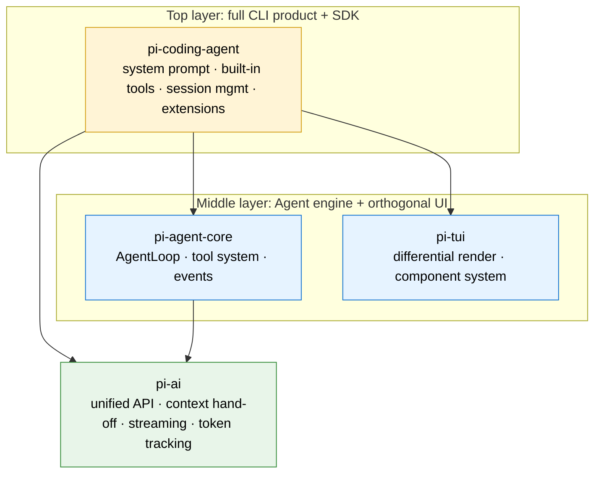

# Chương 1: Mở đầu: Tại sao Pi-Agent đáng để bạn dành thời gian

> Đây là chương mở đầu của "Pi-Agent chuyên sâu." Chương này không đi vào chi tiết source code; nó trả lời một câu hỏi nền tảng hơn: Pi là gì, và tại sao nó đáng để bạn dành thời gian? Đến cuối chương, bạn sẽ có một mô hình tinh thần rõ ràng về ba danh tính (identity) của Pi: **công cụ code, tài liệu học tập, SDK phát triển**.

---

## 1. Mở đầu: ba câu hỏi, một đáp án

Có lẽ bạn mở chuỗi bài này vì một trong ba lý do:

1. **"Tôi muốn một coding agent thực sự hoạt động tốt"**: bạn đã chán những công cụ cồng kềnh và muốn thứ gì đó tối giản (minimal), trong suốt (transparent), nhanh.
2. **"Tôi muốn hiểu agent thực sự được xây dựng như thế nào"**: bạn đã đụng vào source code của các framework agent khác, và chúng hoặc quá phức tạp (hàng chục nghìn dòng) hoặc quá sơ sài (một vòng `while` loop tự gọi mình là agent).
3. **"Tôi muốn tự xây agent của riêng mình"**: bạn có một use case dọc theo ngành và cần xây dựng trên SDK thay vì bắt đầu từ đầu.

Ba câu hỏi này khớp chính xác với ba danh tính của Pi. Việc cả ba cùng trỏ về một dự án duy nhất đã đáng để tò mò rồi.

Trước khi đi sâu vào source code, hãy lùi ra và nhìn toàn cảnh.

---

## 2. Pi là gì: một sơ đồ là đủ

### Định nghĩa một câu

**Pi là một shell coding agent tối giản, có khả năng mở rộng (extensible), chạy trên terminal (coding agent harness), được tạo bởi Mario Zechner (tác giả libGDX), viết hoàn toàn bằng TypeScript, phát hành theo giấy phép MIT.**

Tách ra từng phần:

- **"Coding Agent"**: nó đọc codebase của bạn, viết code, sửa code, chạy lệnh; như một người pair-programming ngồi cạnh bạn.
- **"Terminal Shell"**: nó sống trong terminal, không có GUI, không có IDE plugin; output ghi vào terminal scrollback buffer. Quyết định đơn lẻ này chi phối mọi lựa chọn thiết kế phía sau.
- **"Tối giản" (Minimal)**: bốn tool tích hợp sẵn cốt lõi (`read` / `write` / `edit` / `bash`), một template system prompt tĩnh khoảng 90 từ tiếng Anh (khoảng 200–400 từ sau khi ghép tools, skills, contextFiles lúc runtime), và khoảng 12.000 dòng code TUI (riêng file `tui.ts` cốt lõi khoảng 1.700 dòng). Nó cố ý **không** xây MCP, sub-agent, plan mode, hộp thoại phân quyền, hay background bash.
- **"Có thể mở rộng" (Extensible)**: những tính năng còn thiếu phía trên lõi tối giản được bổ sung bằng Extensions, Skills, và Pi Packages viết bằng TypeScript.

### Những con số chính

| Chỉ số | Giá trị | Ý nghĩa |
| --- | --- | --- |
| GitHub Stars | 64.000+ | Mười tháng tăng trưởng; nhu cầu đã được cộng đồng xác nhận. |
| Tool tích hợp sẵn | 4 cốt lõi + 3 hỗ trợ | Cốt lõi: `read` / `write` / `edit` / `bash`; hỗ trợ: `grep` / `find` / `ls`. |
| System prompt | Template tĩnh ~90 từ (200–400 từ lúc runtime) | So với hàng chục nghìn từ của Claude Code. |
| Quy mô code TUI | ~12.000 dòng | Riêng file `tui.ts` cốt lõi khoảng 1.700 dòng; thể hiện sự "kìm nén" từ background làm game engine của Mario. |
| Provider được hỗ trợ | 30+ nhà cung cấp | Enum `KnownProvider` trong source thực ra liệt kê 35 (bao gồm biến thể khu vực); khoảng 27 thương hiệu độc lập: Anthropic, OpenAI, Google, Groq, Ollama, v.v. |
| Package cốt lõi | 4 | `pi-ai` / `pi-agent-core` / `pi-tui` / `pi-coding-agent`. |
| Chế độ chạy | 4 | Tương tác / print-JSON / RPC / SDK. |

> **Ghi chú về các con số**: Tài liệu marketing ban đầu của Pi hay nói "4 tool tích hợp sẵn", "15+ nhà cung cấp", và "~600 dòng TUI". Hai con số đầu ám chỉ **4 tool cốt lõi** (không tính `grep` / `find` / `ls`) và danh sách nhà cung cấp nổi tiếng được chọn lọc từ các phiên bản đầu. "600 dòng TUI" chính xác cho phiên bản đầu; đến v0.80.2 nó đã tăng lên khoảng 12.000 dòng. Bảng này phản ánh **con số source code thực tế của v0.80.2** để người đọc đối chiếu với source không bị bối rối.

### Bốn package cốt lõi, mỗi cái một việc

```
┌──────────────────────────────────────────┐
│          pi-coding-agent                 │  ← Sản phẩm CLI đầy đủ + SDK
│  System prompt · Tool tích hợp sẵn · Quản lý session · Extensions  │
├──────────────────────────────────────────┤
│  pi-tui              │  pi-agent-core    │  ← Terminal UI + Agent engine
│  Differential render  │  AgentLoop · Tool │
│  · hệ component       │  system · events  │
├──────────────────────┴───────────────────┤
│              pi-ai                       │  ← Lớp trừu tượng LLM đa nhà cung cấp
│  Unified API · Context hand-off · Streaming · Theo dõi Token  │
└──────────────────────────────────────────┘
```



Trong bốn lớp này, `pi-ai` / `pi-agent-core` / `pi-coding-agent` tạo thành một **stack ba lớp** (mỗi lớp dùng độc lập được), và `pi-tui` là một **thư viện UI trực giao (orthogonal)** tách rời hoàn toàn khỏi hệ thống Agent: bạn có thể chỉ dùng `pi-ai` để gọi model, hoặc dùng `pi-agent-core` để chạy một Agent Loop trong ứng dụng của riêng bạn mà không cần đụng vào CLI. Đây là giá trị cốt lõi của Pi với tư cách SDK; chúng tôi sẽ trình bày chi tiết trong mục 5.

Kiến trúc bốn lớp của Pi-Agent

> Còn có một `pi-orchestrator` thử nghiệm (thêm vào v0.80.x) dùng để điều phối nhiều agent; nó không nằm trong lộ trình học cốt lõi.

---

## 3. Góc nhìn 1: với tư cách coding agent: một công cụ hằng ngày thực sự tốt

### 3.1 Pi là gì: khối xếp hình (building blocks), không phải chiếc xe hoàn chỉnh

Tóm tắt vị trí của Pi trong một câu: **Pi không phải một Cursor hay Claude Code khác: nó là một hộp khối xếp hình để bạn tự lắp ráp coding agent theo cách của mình.**

Một phép so sánh hữu ích. Cursor là một chiếc xe hoàn chỉnh: ghế, điều hòa, định vị đều lắp sẵn, bạn ngồi vào là lái được. Claude Code cũng là chiếc xe hoàn chỉnh, chỉ là gắn động cơ đua và hệ thống treo cứng hơn. Pi thì khác: nó đưa cho bạn động cơ, khung gầm, trục lái, hệ thống dây điện, kèm theo lời đảm bảo rằng "chúng tôi đã kiểm tra tổ hợp này chạy được rồi". Nó đi kèm cấu hình mặc định chạy được ngay khi mở hộp (gõ `pi` là lên), nhưng giá trị cốt lõi của nó là: bạn có thể tháo các bộ phận ra, lắp lại, thêm mới, hoặc thay đổi kiểu dáng, và xây một **chiếc xe vừa khít với workflow của bạn**.

Định vị này là nguồn gốc của mọi quyết định thiết kế trong Pi. Khi đã hiểu nó, mọi điều sau đây đều hợp lý:

- Tại sao system prompt chỉ khoảng 1.000 token? Vì "nên nói gì" phải do bạn quyết, không phải framework đoán trước.
- Tại sao chỉ có 4 tool tích hợp sẵn (`read` / `write` / `edit` / `bash`)? Vì nhiều tool tích hợp sẵn = nhiều ràng buộc không thể thay đổi.
- Tại sao không có MCP / plan mode / sub-agent / todo? Vì đó là "tính năng của xe hoàn chỉnh": Pi để chúng cho bạn. Muốn gì? Tự xây bằng Extension.

Nhà quan sát cộng đồng Pasquale diễn đạt sự khác biệt này sắc nhất:

> "Các công cụ như Claude Code và Codex CLI tối ưu cho 'đạt thành công đầu tiên nhanh chóng trong một môi trường được đánh bóng' … Pi chuyển ưu tiên sang 'quyền sở hữu công cụ'. Nó không đưa cho bạn plan mode; nó đưa cho bạn **những khối xây dựng cần thiết để dựng một plan mode làm đúng những gì bạn muốn**."

Không phải nói Pi "không thể dùng ngay": nó hoàn toàn có thể. Gõ `pi` một lần là bạn đang trò chuyện với một coding agent có năng lực. Nhưng sự "tốt" của Pi không phải thứ nó thêm vào cho bạn; nó là thứ nó **để lại cho bạn thêm vào sau khi đã làm phép trừ**. Một nhà quan sát cộng đồng gọi nó là "shell có thể điều khiển (steerable) nhất thế giới": steerable không phải vì nó phản hồi nhanh, mà vì bạn có quyền phủ quyết và cần điều chỉnh trên mọi hành động của nó.

**Kiểm tra đối tượng phù hợp**: nếu bạn sống trong terminal, quen `tmux` và container, và khó chịu với mỗi tính năng không tắt được: Pi là dành cho bạn. Nếu bạn muốn zero-config chạy ngay và cấu hình tối thiểu: chọn Cursor hoặc Claude Code. Đây không phải vấn đề tốt xấu; là vấn đề phù hợp workflow.

### 3.2 Năm cần điều chỉnh: tính năng Pi thiếu, bạn có thể tự xây

Mục 3.1 đã nói Pi không có MCP, không có plan mode, không có sub-agent, không có loop mode, không có todos. Có thể bạn sẽ hỏi: nhưng đó là các tính năng chuẩn của agent thương mại: tôi muốn thì làm sao?

Đáp án nằm ở câu đó của §3.1: "Pi đưa cho bạn những khối xây dựng cần thiết để dựng plan mode". Pi đưa cho bạn **năm cần điều chỉnh** để uốn nó thành thứ bạn muốn: bốn cái đầu dùng cho bản thân, cái thứ năm dùng để chia sẻ kết quả với người khác. **Năm cần điều chỉnh này mới là năng lực thực sự của Pi**: lõi tối giản cộng với các cần điều chỉnh mạnh, nên thứ bạn nhận được là "một agent có thể lớn lên thành bất kỳ hình dạng nào", không phải "một agent đã được tác giả quyết định hình dạng".

**Extensions: cần điều chỉnh bị đánh giá thấp nhất và cũng mạnh nhất**

Extensions là các file TypeScript mà Pi tự động load, và hỗ trợ hot reload. Sửa file extension và session đang chạy nhận ngay lập tức: không cần khởi động lại. Nghe thì nhỏ, nhưng đây là tính năng "sát thủ": nó mở ra một cách chơi độc đáo: **để coding agent tự sửa năng lực của chính nó**. Mario đã nhấn mạnh điểm này trong một bài nói trước đây.

Extensions chạm sâu: tools, slash commands, phím tắt, event hooks, toàn bộ cây component TUI: nói ngắn gọn, **Pi không giấu gì; nó phơi bày tất cả nội tạng cho bạn**.

Điểm mấu chốt: **mọi "tính năng Pi không có" từ §3.1 đều có thể cài đặt bằng Extension**. Repo Pi đi kèm hơn 50 ví dụ extension chính thức. Nhà quan sát cộng đồng Rushi đã phân tích điều này:

> "Những năng lực bạn có lẽ sẽ mặc định cho là tích hợp sẵn: **sub-agent, plan mode, permission gates, sandbox, MCP integration, custom editor**: đều có thể cài đặt bằng Extensions và được cung cấp dưới dạng ví dụ trong repo."

Nói thẳng: agent thương mại hàn chết các tính năng này vào sản phẩm; Pi tháo rời chúng thành các module tùy chọn. Muốn MCP? Cài Extension MCP. Muốn sub-agent? Có sẵn extension sinh một instance Pi mới. Muốn loop mode (để agent tự lặp cho đến khi xong việc)? Viết extension chặn sự kiện `turn_end` và kích hoạt vòng tiếp theo: chương 11 sẽ dẫn bạn viết từ đầu.

Điểm sắc hơn nữa: **nếu extension chính thức không vừa, bạn có thể tự viết một extension làm đúng thứ bạn cần**. Mario đã kể một ví dụ: có người viết trong năm phút một bộ `read` / `write` / `edit` / `bash` tùy chỉnh chạy qua SSH: thay thế hoàn toàn tool tích hợp sẵn. Nếu muốn thêm hộp thoại phê duyệt phân quyền vào Pi (mặc định là YOLO), khoảng 50 dòng code Extension là đủ. Nếu muốn fork toàn bộ UI (chạy agent trong trình duyệt, vẽ lại giao diện bằng React), cũng làm được. **Năng lực của Pi tăng tuyến tính theo mức độ bạn sẵn sàng tùy chỉnh nó.**

**Skills: gói năng lực load theo nhu cầu**

Skills là gói năng lực gói "hướng dẫn + tool". Chúng dùng **progressive disclosure** (lộ dần theo nhu cầu): chỉ vào context khi được gọi; bình thường không tốn token nào. Skills giải quyết mâu thuẫn cốt lõi: bạn muốn thư viện năng lực phong phú, nhưng không muốn mỗi session phải trả "thuế context" cho năng lực không dùng tới.

Quan hệ giữa Skills và Extensions có thể tóm lại như sau: Extensions **thêm năng lực mới cho agent** (tool mới, command mới, chế độ mới); Skills **thêm tri thức mới cho agent** ("khi gặp task X, làm theo cách này"). Hai cái có thể xếp chồng: một Extension có thể đăng ký nhiều Skill, và một Skill có thể gọi tool do Extension cung cấp.

**Prompt Templates: workflow tái sử dụng**

Template Markdown cho tác vụ lặp lại, có hỗ trợ tham số. Nếu bạn làm code review mỗi ngày, bạn có thể viết template gói sẵn "đọc diff, kiểm tra style, đưa phản hồi". Cần thì gọi một slash command là load ngay.

**Themes: skin TUI có thể reload ngay**

Theme trực quan cho TUI. Đổi giữa session và theme mới áp dụng ngay lập tức. Cần điều chỉnh nhẹ nhất trong năm cái, nhưng quan trọng với người dùng lâu dài: nếu bạn nhìn một công cụ cả ngày, nó phải dễ chịu với mắt bạn.

**Pi Packages: đóng gói bốn cái trên để phân phối**

Extensions, Skills, templates và themes có thể đóng gói thành Pi Package, cài đặt từ npm hoặc git:

```
pi install npm:@foo/pi-tools
# hoặc trực tiếp từ git repo
pi install git:github.com/user/repo
```

Mô hình này rất giống package manager bạn dùng hằng ngày: sự quen thuộc đó là một phần lý do nó được áp dụng nhanh. **Bạn viết xong một extension, đăng lên npm, và bất kỳ người dùng Pi nào trên thế giới cũng có thể cài bằng một lệnh.** Điều này mở rộng "tự xây" từ "cho bản thân mình" ra "chia sẻ cùng cộng đồng".

> Ghi chú: các pattern chi tiết cho Extensions, Skills, templates, themes và Pi Packages được trình bày trong các chương sau của tutorial này. Mục này chỉ thiết lập tư duy rằng "Pi có thể uốn nắn được, và thứ gì thiếu đều có thể bạn tự bổ sung".

### 3.3 Lợi ích hằng ngày: cấu hình mặc định đã tốt rồi

Sau khi đã nói "Pi là khối xếp hình", quay lại câu hỏi thực tế: sau khi bạn **lắp bộ Pi mặc định**, dùng làm công cụ code hằng ngày thì trải nghiệm thế nào? Đáp án: hay đến mức bất ngờ.

Pi đứng thứ hai trên benchmark TerminalBench (khoảng 82 tác vụ sử dụng máy tính và lập trình để đánh giá Agent), dùng Claude Opus 4.5 chỉ sau Terminus: mặc dù Pi **không có hỗ trợ MCP, không có sub-agent, không có plan mode, không có background bash, không có todo tích hợp sẵn**. Kết quả này cho thấy một điều: quan điểm tối giản không hy sinh năng lực; những "tính năng của xe hoàn chỉnh" không cần thiết cho một agent có năng lực.

Dưới đây là vài lợi ích bạn có ngay khi dùng mặc định:

**Context sạch đến mức đáng ghen tị.** Đây là điểm khác biệt cứng nhất của Pi. System prompt cộng định nghĩa tool cộng lại chưa đến 1.000 token, so với hàng chục nghìn của Claude Code. Context window là tài nguyên khan hiếm nhất của agent: phần overhead hướng dẫn cố định càng ít, phần dành cho code và ngữ cảnh dự án của bạn càng nhiều. Pi không lặng lẽ tiêm bất kỳ thứ gì sau lưng bạn; mọi prompt đều công khai trong source, và bạn thậm chí có thể thay thế toàn bộ system prompt bằng cách đặt vào file `SYSTEM.md`.

**Trong suốt đến tận xương.** Bạn thấy mọi message model nhận, mọi input/output đầy đủ của mỗi tool call, theo dõi chi phí đầy đủ giữa các session, và xuất session ra HTML/JSON. Ai đã dùng coding agent khác có lẽ đều trải qua cảnh này: agent ra một quyết định kỳ lạ, bạn muốn biết tại sao, nhưng bạn không thấy nó "đã thấy" cái gì. Pi không có hộp đen như vậy.

**Tự do chọn model (30+ nhà cung cấp).** Pi hỗ trợ 35 mục `KnownProvider` (Anthropic, OpenAI, Google, Azure, Bedrock, Mistral, Groq, Cerebras, xAI, Hugging Face, Kimi, MiniMax, OpenRouter, Ollama, DeepSeek, Zhipu, Xiaomi, Together, Fireworks, v.v., deduplicated còn khoảng 27 thương hiệu độc lập). Quan trọng hơn, bạn có thể **đổi model giữa session**: dùng `/model` hoặc `Ctrl+L`. Dùng Claude cho lập luận phức tạp, chuyển sang MiniMax cho xử lý văn bản đơn giản tiết kiệm chi phí. `pi-ai` xử lý context hand-off giữa các nhà cung cấp bên dưới (chuyển thought-trace, replay signed blob, v.v.); về bản chất là lossy, nhưng vẫn tốt hơn nhiều so với "đổi model = bắt đầu lại từ đầu".

**Session hình cây: đi nhầm đường thì rẽ nhánh.** Pi lưu session dưới dạng **cấu trúc cây** (DAG: đồ thị có hướng không chu trình), không phải log tuyến tính. `/tree` nhảy đến bất kỳ message lịch sử nào và rẽ nhánh mới từ đó. Tất cả nhánh sống chung trong một file. Đặc biệt hữu ích khi debug: bạn có thể thử ba cách sửa khác nhau từ cùng một điểm xuất phát mà không lo "không quay lại được".

**YOLO mode và triết lý an toàn.** Pi mặc định YOLO: agent thực thi hành động mà không hỏi phê duyệt. Lập luận của Mario: biện pháp an toàn dựa trên phê duyệt sẽ gây mệt mỏi cho người dùng ("prompt fatigue"), cuối cùng hoặc bị tắt hoàn toàn hoặc bị giảm xuống thành thao tác bấm "có" máy móc: trở thành "security theater". Anh ấy đề xuất container hóa làm ranh giới an toàn. Nếu thực sự cần flow phê duyệt, khoảng 50 dòng code Extension có thể tự xây: framework phơi bày mọi hook cần thiết.

### 3.4 Lên sóng trong một phút

```
curl -fsSL https://pi.dev/install.sh | sh
# hoặc
npm install -g --ignore-scripts @earendil-works/pi-coding-agent
```

Sau đó chạy `pi` trong bất kỳ thư mục dự án nào. Đặt biến môi trường `ANTHROPIC_API_KEY`, hoặc dùng `/login` để xác thực, là bạn đã sẵn sàng.

### 3.5 Không qua biến môi trường: định nghĩa model bên thứ ba bằng `models.json`

Tutorial chính thức mặc định bảo bạn đặt `ANTHROPIC_API_KEY`, nhưng trong dự án thực, có lẽ bạn muốn dùng Zhipu, DeepSeek, Kimi, hoặc Qwen. Bạn **không thể nối các nhà cung cấp này chỉ bằng một biến môi trường**: bạn cần nói cho Pi biết: base URL ở đâu, dùng giao thức API nào, model ID là gì, context window lớn bao nhiêu.

Giải pháp của Pi là một file cấu hình JSON cục bộ: `~/.pi/agent/models.json` (trên Windows: `C:\Users\<bạn>\.pi\agent\models.json`). File được đọc tự động khi khởi động bởi [`ModelRegistry.create()`](https://github.com/earendil-works/pi/blob/main/packages/coding-agent/src/core/model-registry.ts#L367), không cần tham số dòng lệnh.

**Một ví dụ thực tế**:

```
{
  "providers": {
    "zhipu": {
      "baseUrl": "https://open.bigmodel.cn/api/paas/v4",
      "api": "openai-completions",
      "apiKey": "<your-zhipu-key>",
      "models": [
        { "id": "glm-4.5-air", "name": "GLM-4-Air" },
        { "id": "glm-4-flash", "name": "GLM-4-Flash" }
      ]
    },
    "deepseek": {
      "baseUrl": "https://api.deepseek.com",
      "api": "openai-completions",
      "apiKey": "<your-deepseek-key>",
      "models": [
        { "id": "deepseek-v4-flash", "name": "DeepSeek V4 Flash" },
        {
          "id": "deepseek-v4-pro",
          "name": "DeepSeek V4 Pro",
          "contextWindow": 1000000,
          "maxTokens": 384000
        }
      ]
    }
  }
}
```

Tách ra các trường chính:

- **`providers`**: tầng trên cùng là map nhà cung cấp; các khóa (`zhipu` / `deepseek`) là tên bạn tự đặt và sẽ trở thành trường `provider` của model trong UI.
- **`api`**: chọn giao thức. Phổ biến nhất là `openai-completions` (tương thích OpenAI; hầu hết nhà cung cấp Trung Quốc đều hỗ trợ), tiếp theo `anthropic-messages`, rồi `openai-responses`. Trường này quyết định định dạng request Pi sẽ dùng.
- **`baseUrl`**: endpoint của nhà cung cấp.
- **`apiKey`**: lưu dạng plaintext. **Hãy chắc chắn `.pi/` có trong `.gitignore`**, nếu không một `git add. ` bất cẩn sẽ làm lộ key.
- **`models`**: danh sách model của nhà cung cấp này. `id` là tên model thực tế truyền cho API; `name` là nhãn thân thiện hiển thị trong TUI.
- **`contextWindow` / `maxTokens`**: tùy chọn; cho Pi biết cửa sổ và độ dài output tối đa của model, từ đó quyết định chiến lược nén ngữ cảnh.

**Sau khi cấu hình, dùng thế nào?** Ba cách:

1. **Đổi tại chỗ**: bấm `/model` hoặc `Ctrl+L` trong session, fuzzy-search trong tất cả model đã load (kể cả model bạn vừa thêm) và chọn một.
2. **Đặt làm mặc định**: sửa `~/.pi/agent/settings.json`, thêm `"defaultProvider": "deepseek"` và `"defaultModel": "deepseek-v4-pro"`, Pi sẽ dùng nó khi khởi động.
3. **Liệt kê từ dòng lệnh**: `pi models` (hoặc `pi models deepseek` để fuzzy filter). Lỗi in ở đầu terminal để bạn debug phần parse `models.json`.

`models.json` hỗ trợ hai cách dùng nâng cao (tutorial này không trình bày): dùng `modelOverrides` để vá **một model cụ thể của một nhà cung cấp tích hợp sẵn** (ví dụ, trỏ `baseUrl` về gateway tự host); dùng trường `compat` để xử lý giao diện không chuẩn (ví dụ, gateway cần tên trường `max_tokens` đặc biệt). Schema đầy đủ được định nghĩa tại [`model-registry.ts:158-218`](https://github.com/earendil-works/pi/blob/main/packages/coding-agent/src/core/model-registry.ts#L158-L218).

---

## 4. Góc nhìn 2: với tư cách tài liệu học tập: giáo trình thiết kế Agent

Danh tính thứ hai: Pi là giáo trình tuyệt vời để học "cách xây một Agent cấp production".

### 4.1 Tại sao là Pi? Vì nó đủ nhỏ để đọc hết

Nhiều framework agent có hàng chục nghìn dòng code; hiểu nổi mỗi flow khởi động đã phải đọc hàng chục file. Vòng lặp cốt lõi của Pi chỉ vài trăm dòng, nhưng chất lượng thiết kế của nó không hề "sơ sài": nó đứng thứ hai trên TerminalBench (dùng Claude Opus 4.5), chỉ sau Terminus, mặc dù thiếu MCP, sub-agent, plan mode và đồng loại.

**Điều đó có nghĩa bạn có thể thực sự "đọc hết" core code của một agent chất lượng cao trong thời gian giới hạn.** Điều này không thể làm với Claude Code; cũng không thể với LangChain.

### 4.2 Tutorial này sẽ trình bày gì

Tutorial này (phiên bản có hình minh họa) hiện có **10 chương đã xuất bản**. Sáu chương đầu xây dựng hiểu biết cốt lõi; bốn chương sau đi vào các chủ đề kỹ thuật nâng cao:

| Chương | Chủ đề | Câu hỏi cốt lõi | Mức độ |
| --- | --- | --- | --- |
| Chương 1 | Tổng quan mở đầu | Pi là gì? Tại sao đáng học? | Nhập môn |
| Chương 2 | Cấu trúc dự án & kiến trúc phân lớp | Bốn package phân chia việc thế nào? Tại sao phân lớp vậy? | Nhập môn |
| Chương 3 | Agent Loop | Làm sao LLM liên tục suy nghĩ và hành động? | ★ Cốt lõi |
| Chương 4 | Gọi model | Bằng cách nào gọi 30+ nhà cung cấp qua một code path? | ★ Cốt lõi |
| Chương 5 | Tool System | Tool được định nghĩa, xác thực và thực thi ra sao? | ★ Cốt lõi |
| Chương 6 | Message System | Lịch sử hội thoại được biểu diễn và truyền tải thế nào? | ★ Cốt lõi |
| Chương 7 | Kiến trúc hướng sự kiện | Tại sao cần sự kiện? | Nâng cao |
| Chương 8 | Context Engineering | Làm sao cửa sổ hữu hạn chứa cuộc hội thoại vô hạn? | Nâng cao |
| Chương 9 | Nén ngữ cảnh | Hội thoại quá dài thì làm sao? | Nâng cao |
| Chương 10 | Quản lý Session | Session được lưu, khôi phục và rẽ nhánh ra sao? | Nâng cao |

> **Lộ trình phía trước**: chương 11 (hệ thống Extension), chương 12 (pattern kiểm thử), chương 13 (tổng kết tinh hoa thiết kế), và các chủ đề nâng cao khác chưa có trong tutorial này. Bạn đọc quan tâm có thể tham khảo source code và tài liệu của [repo chính thức Pi](https://github.com/earendil-works/pi).

> **Lời khuyên đọc**: chương 1–6 nên đọc theo thứ tự; chúng là nền tảng để hiểu runtime của Pi. Từ chương 7 trở đi mỗi chương khá độc lập; nhảy vào theo chủ đề khi cần.

Mỗi chương trả lời ba lớp câu hỏi: **cái gì** (khái niệm), **thế nào** (phân tích source code), **tại sao vậy** (đánh đổi thiết kế).

### 4.3 "Triết lý trừ" của Pi: bài học thật sự nằm trong đánh đổi

Nhìn một framework "làm tất cả mọi thứ", bạn chỉ học được "họ đã làm gì". Nhìn một framework cố ý không làm gì, bạn học được "thực sự cần gì để xây một agent".

Mục "What we did not build" trên site chính thức Pi là một bản tuyên ngôn viết ngược. Đối thủ liệt kê tính năng; Pi liệt kê những thứ đã bỏ. Mỗi sự hy sinh đều có lý do kỹ thuật rõ ràng:

| Pi không làm | Tại sao không | Cách thay thế |
| --- | --- | --- |
| Hỗ trợ MCP | Một MCP server (ví dụ Playwright MCP) tiêm 13.700+ token mô tả tool ngay đầu session | CLI tool có README; Agent đọc theo nhu cầu |
| Sub-agent | Tăng độ phức tạp, giảm khả năng quan sát | Nhiều instance qua `tmux`, hoặc Extension riêng |
| Hộp thoại phân quyền | Gây "prompt fatigue", suy thoái thành security theater | Cô lập bằng container, hoặc dựng flow phê duyệt qua Extension |
| Plan mode | Plan viết vào file markdown bền hơn và tái sử dụng được | Chỉ cần viết file `plan.md` |
| Background bash | `tmux` đã giải quyết vấn đề này rồi | Dùng `tmux` |
| Todo tích hợp sẵn | File `TODO.md` linh hoạt hơn | Dùng file markdown, hoặc tự xây Extension |

Những đánh đổi này là chìa khóa để hiểu triết lý thiết kế của Pi, và cũng là tư liệu suy nghĩ có giá trị nhất khi bạn học thiết kế agent.

---

## 5. Góc nhìn 3: với tư cách SDK: xây Agent của riêng bạn

Danh tính thứ ba: Pi là một bộ SDK có thể tái sử dụng độc lập, cho phép bạn xây dựng ứng dụng agent của mình trên nền tảng của nó.

### 5.1 Stack SDK: kiến trúc ba lớp cộng một thư viện UI trực giao

Nhìn lại sơ đồ kiến trúc bốn lớp ở mục 2: chú ý rằng `pi-tui` được vẽ **song song** với `pi-agent-core`. Nó không nằm trong chuỗi stack; nó là "phụ thuộc bên" mà `pi-coding-agent` chỉ dùng trong chế độ tương tác. Vậy nên từ góc độ tái sử dụng SDK, Pi thực ra là một **stack ba lớp** (`pi-ai` → `pi-agent-core` → `pi-coding-agent`), cộng với một **thư viện UI terminal trực giao** (`pi-tui`). Mỗi lớp của stack dùng độc lập được, và thư viện UI cũng dùng độc lập được: nhưng nó giải quyết một lớp vấn đề khác không liên quan đến agent.

**Layer 1: `pi-ai`: chỉ gọi model**

```typescript
// Entry nằm trong sub-module compat (không phải entry chính)
import { getModel, stream } from "@earendil-works/pi-ai/compat";
import type { Context } from "@earendil-works/pi-ai";

const model = getModel("anthropic", "claude-sonnet-4-5");
// Context là interface (không phải class), khởi tạo bằng object literal
const context: Context = {
  systemPrompt: "You are helpful.",
  messages: [{ role: "user", content: "Hello!" }],
};

// stream() trả về event stream; complete() trực tiếp await để lấy AssistantMessage cuối cùng
const eventStream = stream(model, context);
for await (const event of eventStream) {
  if (event.type === "text_delta") process.stdout.write(event.delta);
}
```

`pi-ai` không phụ thuộc bất kỳ khái niệm agent nào. Bạn có thể dùng nó trong bất kỳ dự án nào cần gọi LLM: chatbot, phân tích tài liệu, công cụ review code, thậm chí ứng dụng hoàn toàn không liên quan đến agent. Nó hỗ trợ 30+ nhà cung cấp, streaming output, context hand-off giữa nhà cung cấp, theo dõi chi phí token, và chạy phía trình duyệt.

**Layer 2: `pi-agent-core`: chỉ chạy vòng lặp**

```typescript
// Minh họa sư phạm (đơn giản hóa); xem class Agent tại agent.ts:166 trong API thực
// Constructor của Agent chỉ nhận AgentOptions (convertToLlm / streamFn / beforeToolCall, v.v.)
// model / tools / systemPrompt được truyền lúc gọi prompt() qua AgentSessionConfig
import { Agent } from "@earendil-works/pi-agent-core";
// Lưu ý: defineTool nằm trong package coding-agent, không có trong agent-core
// import { defineTool } from "@earendil-works/pi-coding-agent";

const agent = new Agent({
  /* AgentOptions: hooks, streamFn, convertToLlm, v.v. */
});

// Entry thực sự là agent.prompt(), bên trong gọi private runWithLifecycle()
// Event stream trả về phải consume qua subscribe(listener); các kiểu event nằm trong union AgentEvent ở types.ts
```

`pi-agent-core` phụ thuộc `pi-ai`, nhưng không phụ thuộc `pi-coding-agent` hay `pi-tui`. Bạn có thể dùng nó để xây bất kỳ loại agent nào: không giới hạn ở kịch bản coding. Agent phân tích dữ liệu, agent chăm sóc khách hàng, agent kiểm thử tự động: bất kỳ kịch bản nào cần vòng lặp "model suy nghĩ → gọi tool → xem kết quả → suy nghĩ tiếp" đều dùng được.

**Layer 3: `pi-coding-agent`: CLI đầy đủ + SDK**

Đây là đỉnh stack, lắp ráp hai lớp dưới thành một sản phẩm coding agent hoàn chỉnh. Nó cũng phơi bày giao diện SDK để bạn nhúng Agent vào ứng dụng của mình theo chế độ "headless" (không có UI):

```typescript
import { createAgentSession } from "@earendil-works/pi-coding-agent";
import { getModel } from "@earendil-works/pi-ai/compat";

const session = await createAgentSession({
  cwd: "/path/to/project",
  model: getModel("anthropic", "claude-sonnet-4-5"), // Model object, không phải {id, api}
});

// subscribe nhận một hàm listener; event được định kiểu bởi union AgentSessionEvent
session.subscribe((event) => {
  if (event.type === "turn_end") {
    console.log("Agent đã hoàn thành một vòng suy nghĩ");
  }
});

await session.prompt("Read the codebase and explain the architecture.");
```

**Thư viện bên: `pi-tui`: thư viện UI terminal không liên quan đến Agent**

`pi-tui` xứng đáng được tách riêng vì nó có một thuộc tính đặc biệt: **hoàn toàn độc lập với hệ thống agent của Pi**. [`package.json`](https://github.com/earendil-works/pi/blob/main/packages/tui/package.json) của nó chỉ phụ thuộc `get-east-asian-width` và `marked` (parse Markdown); source của nó có 0 lệnh `import` từ các package anh em `@earendil-works/pi-*`. Ngược lại mới đúng: `coding-agent` phụ thuộc `pi-tui` một chiều (ví dụ [`list-models.ts:6`](https://github.com/earendil-works/pi/blob/main/packages/coding-agent/src/cli/list-models.ts#L6) import `fuzzyFilter` từ `pi-tui`).

`pi-tui` là nghề cũ của Mario (tác giả game engine libGDX), khoảng 12.000 dòng triển khai:

- **Differential rendering** (render vi sai): chỉ vẽ lại các ô thay đổi mỗi frame, hầu như không nhấp nháy.
- **Retained-mode UI** (UI chế độ giữ lại): hệ component khai báo giống React, không phải kiểu mệnh lệnh của ncurses.
- **Component tích hợp sẵn**: ô input có autocomplete, renderer Markdown, syntax highlighting, tìm kiếm mờ (fuzzy search).

**Nó có tác dụng gì?** Không liên quan gì đến agent: bất kỳ chương trình Node.js nào cần giao diện terminal tương tác đều dùng được: công cụ CLI, dashboard tương tác, game TUI, REPL tùy chỉnh. Nếu bạn từng cảm thấy `blessed` hay `ink` hoặc quá nặng hoặc quá trừu tượng, `pi-tui` là lựa chọn tối giản đáng đọc source.

**Tại sao nó có mặt trong Pi?** Vì Pi chọn hình thức "terminal shell" (xem mục 2). `pi-tui` là component tái sử dụng mà hình thức đó đòi hỏi.

### 5.2 Hệ thống Extension: để Agent tự sửa năng lực của mình

Hệ thống Extension của Pi hỗ trợ **hot reload**: khi Agent sửa file extension, thay đổi có hiệu lực ngay lập tức, không cần khởi động lại session. Điều này mở ra một mô hình mạnh mẽ: **để coding agent tự sửa và tăng cường năng lực của chính nó**.

Extensions có thể triển khai:

- **Custom tool**: định nghĩa tool mới, với xác thực tham số bằng schema TypeBox.
- **UI component**: nhúng giao diện tùy chỉnh vào terminal.
- **Slash command**: đăng ký command `/` mới.
- **Event listener**: móc vào tool call, turn-end và các thời điểm khác.
- **Theme**: tùy chỉnh giao diện TUI.
- **Prompt template**: đoạn prompt có thể tái sử dụng.

Năm cần điều chỉnh này (Extensions, Skills, Prompt Templates, Themes, Pi Packages) về bản chất cung cấp **một con đường nâng cấp mượt mà từ "dùng Pi" sang "sửa Pi"**.

### 5.3 Bốn chế độ chạy

| Chế độ | Trường hợp sử dụng | Ví dụ |
| --- | --- | --- |
| Chế độ tương tác | TUI kinh điển cho lập trình hằng ngày | `pi` |
| Chế độ print / JSON | Script và pipeline CI/CD | `pi -p "explain this code"` |
| Chế độ RPC | Trao đổi JSON qua stdin/stdout | Tích hợp vào chương trình không phải Node.js |
| Chế độ SDK | Nhúng vào ứng dụng của bạn | `createAgentSession()` |

Thiết kế đa chế độ này nghĩa là Pi có thể tiến triển mượt mà từ "công cụ bên cạnh lập trình viên" sang "nhà cung cấp năng lực Agent trong hệ thống production": bạn không cần đổi framework khi dự án lớn lên.

### 5.4 Các dự án mã nguồn mở đã sử dụng

Các dự án như OpenClaw đã sử dụng SDK của Pi trong production, chạy mỗi Agent instance trên nền Pi. Pi Packages có thể được phân phối qua npm hoặc git; một hệ sinh thái đang hình thành.

---

## 6. Mặt đối lập của Pi: hai triết lý ngược nhau

Cách tốt nhất để hiểu Pi là nhìn mặt đối lập của nó.

**Claude Code** đại diện cho con đường "tất cả trong một": plan mode tích hợp sẵn, sub-agent, MCP, hộp thoại phân quyền, theo dõi todo: một "phi thuyền" đầy đủ trang bị. System prompt hàng chục nghìn từ, tính năng nở liên tục, người dùng bị đẩy đi thích nghi với công cụ.

**Everything Claude Code** (214K+ Stars) đẩy triết lý này đến cực đoan: hàng trăm command và Agent đóng gói sẵn, người dùng bắt đầu từ "đầy" rồi từ từ xóa.

**Pi đại diện cho quỹ đạo ngược lại: bắt đầu từ "rỗng" và để bạn lấp đầy.** Lõi tối giản, mở rộng tùy ý. Công cụ thích nghi với workflow của bạn, chứ không phải ngược lại.

Hai triết lý này không tuyệt đối đúng sai. Nhưng nếu bạn là người "muốn biết chính xác Agent đang làm gì", Pi có lẽ phù hợp hơn.

---

## 7. Tổng kết

Pi là dự án "ba trong một":

1. **Với tư cách công cụ**: một coding agent terminal tối giản, trong suốt, có thể điều khiển. Context sạch, tự do model, session hình cây, YOLO mặc định: dành cho lập trình viên muốn toàn quyền kiểm soát công cụ của mình.
2. **Với tư cách giáo trình**: tài liệu tham khảo thiết kế Agent chất lượng cao, có thể đọc hết. 10 chương bao phủ các điểm quyết định cốt lõi của kiến trúc agent (từ Agent Loop đến quản lý session), mỗi dòng code đều có câu trả lời "tại sao làm vậy".
3. **Với tư cách SDK**: bộ công cụ phát triển phân lớp rõ ràng, tái sử dụng độc lập. Stack ba lớp (`pi-ai` → `pi-agent-core` → `pi-coding-agent`) dùng được từng lớp, cộng với thư viện UI terminal `pi-tui` tách rời khỏi agent; bốn chế độ chạy bao phủ mọi kịch bản từ local đến production.

Nhưng quan trọng nhất, Pi chứng minh rằng **phép trừ là một lập trường sản phẩm cạnh tranh**. Trong một thị trường đang lao về phía "tất cả trong một", câu "thứ tôi không cần sẽ không được xây" bản thân nó đã là một tính năng thực sự.

---

> Ghi chú phiên bản
> Chuỗi tài liệu này được viết cho Pi **v0.80.2**. Phân tích code lấy theo repo [earendil-works/pi](https://github.com/earendil-works/pi) (các link tutorial trỏ đến `main`, có thể khác với v0.80.2 ở một số chi tiết nhỏ).


